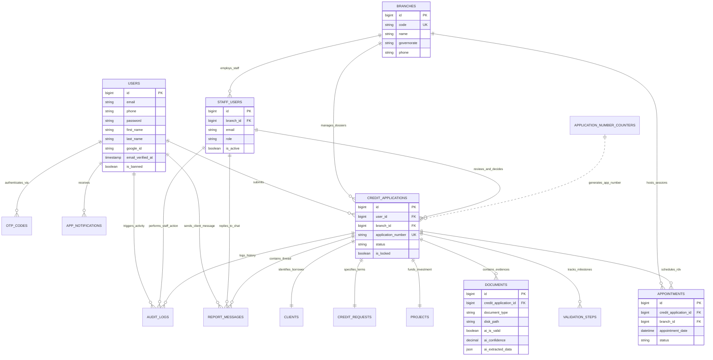

# BTS Bank — Dossier Complet des Diagrammes d'Architecture & Conception

Ce dossier rassemble l'ensemble des diagrammes techniques, relationnels et fonctionnels modelisant la plateforme digitale de demande de credit de la **Banque Tunisienne de Solidarite (BTS Bank)**.

Chaque diagramme utilise des themes visuels professionnels, des jeux de couleurs coherents par domaine metier, et une syntaxe standardisee compatible **Mermaid 11+** et **[Mermaid.ai](https://mermaid.ai)**, sans emojis.

---

## Sommaire des Diagrammes

| N° | Fichier Source | Type de Diagramme | Description & Palette |
|:---|:---------------|:------------------|:----------------------|
| **01** | [`01_system_architecture.mmd`](./01_system_architecture.mmd) | **Architecture Systeme** | Vue globale multi-tiers (3 Frontends Next.js, API Laravel 11, WebSockets Reverb, Base MySQL, Google Gemini AI). |
| **02** | [`02_entity_relationship_diagram.mmd`](./02_entity_relationship_diagram.mmd) | **Modele Donnees (ERD)** | Schema relationnel complet (15 entites reparties en 6 domaines colores). |
| **03** | [`03_use_case_diagram.mmd`](./03_use_case_diagram.mmd) | **Cas d'Utilisation** | Matrice fonctionnelle des roles (Client, Staff, Admin, Google Gemini AI) et modules metier. |
| **04** | [`04_state_transition_diagram.mmd`](./04_state_transition_diagram.mmd) | **Etats-Transitions** | Cycle de vie du dossier de credit (DRAFT -> SUBMITTED -> STAFF_APPROVED -> ADMIN_APPROVED -> APPOINTMENT -> CLOSED). |
| **05** | [`05_sequence_auth_onboarding.mmd`](./05_sequence_auth_onboarding.mmd) | **Sequence : Auth & 2FA** | Inscription, generation de code OTP par email et connexion securisee Sanctum. |
| **06** | [`06_sequence_credit_application_ai.mmd`](./06_sequence_credit_application_ai.mmd) | **Sequence : Demande & IA** | Parcours en 4 etapes et verification automatique des pieces par Google Gemini 1.5. |
| **07** | [`07_sequence_dual_approval_workflow.mmd`](./07_sequence_dual_approval_workflow.mmd) | **Sequence : Double Validation** | Workflow d'instruction a deux niveaux (Staff L1 -> Admin L2) et planification automatique du RDV en agence. |
| **08** | [`08_sequence_realtime_chat_websockets.mmd`](./08_sequence_realtime_chat_websockets.mmd) | **Sequence : Chat Temps Reel** | Messagerie instantanee sur dossier verrouille via Laravel Reverb et canaux prives. |
| **09** | [`09_class_diagram_backend.mmd`](./09_class_diagram_backend.mmd) | **Diagramme de Classes** | Modeles Eloquent (14 classes), Services metier (7 classes) et relations d'heritage/dependance. |
| **10** | [`10_deployment_infrastructure.mmd`](./10_deployment_infrastructure.mmd) | **Deploiement & Infra** | Topologie des conteneurs, repartition des ports (3000, 3001, 3002, 8000, 6001, 3306) et flux reseau. |

---

## Charte Graphique des Couleurs

Les diagrammes utilisent une palette harmonisee :

- **Bleu Royal (`#1565C0` / `#E3F2FD`)** : Utilisateurs, Acteurs Clients, Couche Frontend Client & Entites Utilisateurs.
- **Vert Emeraude (`#2E7D32` / `#E8F5E9`)** : Portails Web, Services Valides, Statuts Approuves.
- **Ambre / Orange (`#E65100` / `#FFF3E0`)** : API Gateway, Securite, Agents Staff, Actions en cours.
- **Violet Profond (`#4527A0` / `#EDE7F6`)** : Cœur de l'application Backend, Direction Admin, Entites Principales (`CreditApplication`).
- **Teal / Cyan (`#00695C` / `#E0F7FA`)** : Infrastructure Temps Reel (Laravel Reverb WebSockets), Donnees Dossier.
- **Rose / Rouge (`#C62828` / `#FCE4EC`)** : Services Externes (Google Gemini 1.5, Gmail, OpenStreetMap), Statuts Rejetes.
- **Gris Ardoise (`#37474F` / `#ECEFF1`)** : Base de Donnees MySQL, Stockage Fichiers, Journaux d'Audit.

---

## 1. Architecture Globale du Systeme

```mermaid
%%{init: {
  'theme': 'base',
  'themeVariables': {
    'primaryColor': '#E8F5E9',
    'primaryTextColor': '#1B5E20',
    'primaryBorderColor': '#2E7D32',
    'lineColor': '#455A64',
    'secondaryColor': '#EDE7F6',
    'tertiaryColor': '#FFF3E0',
    'fontFamily': 'Segoe UI, Inter, Roboto, sans-serif',
    'fontSize': '12px'
  }
}}%%

flowchart TB
    subgraph USERS["USER ROLES & CLIENT ACCESS"]
        direction LR
        U_CLIENT["Client / Borrower<br/><b>(Port 3000)</b>"]:::userNode
        U_STAFF["Agency Staff<br/><b>(Port 3001)</b>"]:::userNode
        U_ADMIN["Central Admin<br/><b>(Port 3002)</b>"]:::userNode
    end

    subgraph FRONTEND_TIER["FRONTEND TIER (Next.js 16 + React 19 + TailwindCSS)"]
        FE_C["<b>Client Portal</b><br/>• Self-registration & OTP<br/>• 4-Step Credit Wizard<br/>• Doc Upload & Google Gemini AI Check<br/>• Appointment Tracker<br/>• Live Dossier Chat"]:::frontendNode
        FE_S["<b>Staff Portal</b><br/>• Dossier Review Dashboard<br/>• L1 Staff Approval / Reject<br/>• Real-time Support Chat<br/>• Agency Scoped Audit"]:::frontendNode
        FE_A["<b>Admin Portal</b><br/>• Executive KPIs & Analytics<br/>• L2 Final Approval / Reject<br/>• Automated RDV Trigger<br/>• Global System Governance"]:::frontendNode
    end

    subgraph API_GATEWAY["API SECURITY & GATEWAY (Laravel 11 - Port 8000)"]
        direction TB
        CORS["CORS & CSRF Middleware"]:::gatewayNode
        RATE["Rate Limiter (Throttle: 6-30 req/min)"]:::gatewayNode
        AUTH_SANCTUM["Laravel Sanctum (Bearer Token Auth)"]:::gatewayNode
        ROLE_GUARD["Role Middleware (staff / staff.role:admin)"]:::gatewayNode
    end

    subgraph BACKEND_DOMAINS["BACKEND APPLICATION CORE (Laravel 11)"]
        subgraph DOMAIN_AUTH["Auth Domain"]
            AUTH_CTRL["<b>AuthController / GoogleAuthController</b><br/>OTP Auth & Google OAuth"]:::backendNode
            OTP_SVC["<b>OtpService & PreAuthTokenService</b><br/>OTP Token Lifecycle"]:::backendNode
            SMS_DRV["<b>Sms/Email Drivers</b><br/>Gmail SMTP / Vonage / Log"]:::backendNode
        end

        subgraph DOMAIN_CREDIT["Credit Application Domain"]
            APP_CTRL["<b>CreditApplicationController</b><br/>4-Step Submission & State Flow"]:::backendNode
            APP_SVC["<b>CreditApplicationService</b><br/>Business Logic & Workflow"]:::backendNode
            VAL_SVC["<b>CreditApplicationValidationService</b><br/>Eligibility & Formula Calculation"]:::backendNode
            AI_SVC["<b>DocumentVerificationService</b><br/>Google Gemini AI OCR & Validation"]:::backendNode
            APPT_SVC["<b>BranchMatching & AppointmentSchedulingService</b><br/>Branch Slot Allocation"]:::backendNode
        end

        subgraph DOMAIN_STAFF["Staff & Governance Domain"]
            STAFF_CTRL["<b>StaffApplicationController</b><br/>Review & Decisions"]:::backendNode
            REVIEW_SVC["<b>CreditApplicationReviewService</b><br/>L1/L2 Approval Workflow Engine"]:::backendNode
            DASH_SVC["<b>DashboardStatsService</b><br/>Executive KPIs & Stats"]:::backendNode
            AUDIT_SVC["<b>ActivityLogService & AuditLogService</b><br/>Compliance & Security Logs"]:::backendNode
        end
    end

    subgraph REALTIME_TIER["REAL-TIME WEBSOCKET LAYER"]
        REVERB["<b>Laravel Reverb WebSocket Server</b><br/>(Port 6001 / 8080)<br/>• Event: ReportMessageSent<br/>• Live Dossier Chat Channel"]:::realtimeNode
    end

    subgraph DATA_TIER["DATA PERSISTENCE & STORAGE"]
        DB[("<b>MySQL 8.x Database</b><br/>'bts_php_backend'<br/>InnoDB • ACID Transactions")]:::dataNode
        STORAGE["<b>Local Document Storage</b><br/>'storage/app/documents'<br/>Secure Document Vault"]:::dataNode
    end

    subgraph EXTERNAL_SERVICES["EXTERNAL THIRD-PARTY SERVICES"]
        EXT_GEMINI["<b>Google Gemini 1.5 API</b><br/>(Document OCR & Verification)"]:::externalNode
        EXT_OSM["<b>Photon / OpenStreetMap</b><br/>(Geocoding & Branch Mapping)"]:::externalNode
        EXT_EMAIL["<b>Gmail SMTP / Resend</b><br/>(OTP & Email Notifications)"]:::externalNode
        EXT_GOOGLE["<b>Google Identity OAuth 2.0</b><br/>(Single Sign-On Authentication)"]:::externalNode
    end

    U_CLIENT ==> FE_C
    U_STAFF ==> FE_S
    U_ADMIN ==> FE_A

    FE_C ==> CORS
    FE_S ==> CORS
    FE_A ==> CORS

    CORS ==> RATE ==> AUTH_SANCTUM ==> ROLE_GUARD

    ROLE_GUARD ==> AUTH_CTRL
    ROLE_GUARD ==> APP_CTRL
    ROLE_GUARD ==> STAFF_CTRL

    AUTH_CTRL -.-> OTP_SVC
    OTP_SVC -.-> SMS_DRV
    SMS_DRV -.-> EXT_EMAIL
    AUTH_CTRL -.-> EXT_GOOGLE

    APP_CTRL ==> APP_SVC
    APP_SVC -.-> VAL_SVC
    VAL_SVC -.-> AI_SVC
    AI_SVC -.-> EXT_GEMINI
    APP_CTRL -.-> STORAGE
    FE_C -.-> EXT_OSM

    STAFF_CTRL ==> REVIEW_SVC
    REVIEW_SVC -.-> APPT_SVC
    STAFF_CTRL -.-> DASH_SVC
    STAFF_CTRL -.-> AUDIT_SVC

    REVIEW_SVC -.-> REVERB
    FE_C <===> REVERB
    FE_S <===> REVERB

    AUTH_CTRL ==> DB
    APP_SVC ==> DB
    REVIEW_SVC ==> DB
    DASH_SVC -.-> DB
    AUDIT_SVC -.-> DB

    style USERS fill:#EBF3FB,stroke:#1565C0,stroke-width:1.5px,stroke-dasharray: 4 4
    style FRONTEND_TIER fill:#E8F5E9,stroke:#2E7D32,stroke-width:1.5px
    style API_GATEWAY fill:#FFF8E1,stroke:#E65100,stroke-width:1.5px
    style BACKEND_DOMAINS fill:#F3E5F5,stroke:#4527A0,stroke-width:1.5px
    style DOMAIN_AUTH fill:#EDE7F6,stroke:#7E57C2,stroke-width:1px
    style DOMAIN_CREDIT fill:#EDE7F6,stroke:#7E57C2,stroke-width:1px
    style DOMAIN_STAFF fill:#EDE7F6,stroke:#7E57C2,stroke-width:1px
    style REALTIME_TIER fill:#E0F7FA,stroke:#00695C,stroke-width:1.5px
    style DATA_TIER fill:#ECEFF1,stroke:#37474F,stroke-width:1.5px
    style EXTERNAL_SERVICES fill:#FCE4EC,stroke:#C62828,stroke-width:1.5px

    classDef userNode fill:#E3F2FD,stroke:#1565C0,stroke-width:2px,color:#0D47A1;
    classDef frontendNode fill:#E8F5E9,stroke:#2E7D32,stroke-width:2px,color:#1B5E20;
    classDef gatewayNode fill:#FFF3E0,stroke:#E65100,stroke-width:2px,color:#BF360C;
    classDef backendNode fill:#EDE7F6,stroke:#4527A0,stroke-width:2px,color:#311B92;
    classDef realtimeNode fill:#E0F7FA,stroke:#00695C,stroke-width:2px,color:#004D40;
    classDef dataNode fill:#ECEFF1,stroke:#37474F,stroke-width:2px,color:#263238;
    classDef externalNode fill:#FCE4EC,stroke:#C62828,stroke-width:2px,color:#880E4F;
```

---

## 2. Modele Relationnel des Donnees (ERD)

---

## 3. Diagramme de Cas d'Utilisation

```mermaid
%%{init: {
  'theme': 'base',
  'themeVariables': {
    'primaryColor': '#E3F2FD',
    'primaryBorderColor': '#1565C0',
    'primaryTextColor': '#0D47A1',
    'lineColor': '#37474F',
    'fontSize': '12px',
    'fontFamily': 'Segoe UI, Roboto, sans-serif'
  }
}}%%

flowchart TB
    subgraph ACTORS["ACTEURS DU SYSTEME"]
        direction LR
        CLIENT((("Client / Demandeur"))):::actorClient
        STAFF((("Agent Staff Agence"))):::actorStaff
        ADMIN((("Administrateur Central"))):::actorAdmin
        AI((("Google Gemini AI Vision"))):::actorAI
    end

    subgraph SYSTEM["BTS BANK SYSTEM"]
        direction TB

        subgraph AUTH_MODULE["Module Authentification & Compte"]
            UC_REG(["S'inscrire en ligne"]):::ucAuth
            UC_OTP(["Vérifier code OTP"]):::ucAuth
            UC_LOGIN(["Se connecter (Sanctum)"]):::ucAuth
            UC_GOOGLE(["Connexion Google OAuth"]):::ucAuth
        end

        subgraph CREDIT_MODULE["Module Demande de Crédit (4 Étapes)"]
            UC_STEP1(["Étape 1: Identité (CIN)"]):::ucCredit
            UC_STEP2(["Étape 2: Crédit & Agence (OSM)"]):::ucCredit
            UC_STEP3(["Étape 3: Projet d'Entreprise"]):::ucCredit
            UC_STEP4(["Étape 4: Téléverser Pièces"]):::ucCredit
            UC_AI_CHECK(["Vérifier par Google Gemini IA"]):::ucCredit
            UC_SUBMIT(["Valider & Soumettre"]):::ucCredit
            UC_TRACK(["Suivre Statut du Dossier"]):::ucCredit
        end

        subgraph REVIEW_MODULE["Module Instruction & Décision"]
            UC_STAFF_REV(["Examiner Dossier (L1)"]):::ucReview
            UC_STAFF_DEC(["Approuver / Rejeter (L1)"]):::ucReview
            UC_ADMIN_DEC(["Décision Finale (L2 Admin)"]):::ucReview
            UC_AUTO_APPT(["Génération Auto RDV"]):::ucReview
        end

        subgraph COLLAB_MODULE["Module Collaboration & Agence"]
            UC_CHAT(["Discuter sur Dossier"]):::ucCollab
            UC_APPT_CONFIRM(["Confirmer / Reprogrammer RDV"]):::ucCollab
            UC_NOTIF(["Recevoir Notifications"]):::ucCollab
        end

        subgraph ADMIN_MODULE["Module Pilotage & Audit"]
            UC_STATS(["Consulter KPIs & Stats"]):::ucAdmin
            UC_AUDIT(["Journal d'Audit & Traçabilité"]):::ucAdmin
            UC_STAFF_MGMT(["Gouvernance Comptes Staff"]):::ucAdmin
        end
    end

    CLIENT --> UC_REG
    CLIENT --> UC_OTP
    CLIENT --> UC_LOGIN
    CLIENT --> UC_GOOGLE
    CLIENT --> UC_STEP1
    CLIENT --> UC_STEP2
    CLIENT --> UC_STEP3
    CLIENT --> UC_STEP4
    CLIENT --> UC_SUBMIT
    CLIENT --> UC_TRACK
    CLIENT --> UC_CHAT
    CLIENT --> UC_APPT_CONFIRM
    CLIENT --> UC_NOTIF

    STAFF --> UC_LOGIN
    STAFF --> UC_STAFF_REV
    STAFF --> UC_STAFF_DEC
    STAFF --> UC_CHAT

    ADMIN --> UC_LOGIN
    ADMIN --> UC_ADMIN_DEC
    ADMIN --> UC_STATS
    ADMIN --> UC_AUDIT
    ADMIN --> UC_STAFF_MGMT

    AI --> UC_AI_CHECK

    UC_STEP4 -.->|Déclenche| UC_AI_CHECK
    UC_ADMIN_DEC -.->|Si Approbation L2| UC_AUTO_APPT
    UC_AUTO_APPT -.->|Propose créneau| UC_APPT_CONFIRM

    classDef actorClient fill:#E3F2FD,stroke:#1565C0,stroke-width:2px,color:#0D47A1
    classDef actorStaff fill:#FFF3E0,stroke:#E65100,stroke-width:2px,color:#BF360C
    classDef actorAdmin fill:#F3E5F5,stroke:#6A1B9A,stroke-width:2px,color:#4A148C
    classDef actorAI fill:#FCE4EC,stroke:#C62828,stroke-width:2px,color:#B71C1C
    classDef ucAuth fill:#E8F5E9,stroke:#2E7D32,stroke-width:2px,color:#1B5E20
    classDef ucCredit fill:#E3F2FD,stroke:#1565C0,stroke-width:2px,color:#0D47A1
    classDef ucReview fill:#FFF8E1,stroke:#F57F17,stroke-width:2px,color:#E65100
    classDef ucCollab fill:#E0F7FA,stroke:#00695C,stroke-width:2px,color:#004D40
    classDef ucAdmin fill:#EDE7F6,stroke:#4527A0,stroke-width:2px,color:#311B92

    style ACTORS fill:#F8F9FA,stroke:#90A4AE,stroke-width:1.5px
    style SYSTEM fill:#FAFAFA,stroke:#B0BEC5,stroke-width:1.5px
    style AUTH_MODULE fill:#F1F8E9,stroke:#A5D6A7,stroke-width:1px
    style CREDIT_MODULE fill:#E3F2FD,stroke:#90CAF9,stroke-width:1px
    style REVIEW_MODULE fill:#FFF8E1,stroke:#FFE082,stroke-width:1px
    style COLLAB_MODULE fill:#E0F7FA,stroke:#80CBC4,stroke-width:1px
    style ADMIN_MODULE fill:#EDE7F6,stroke:#B39DDB,stroke-width:1px
```

