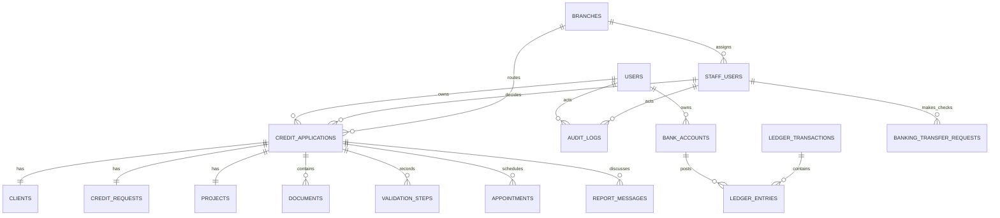

# BTS Bank — audit base de données

## État observé

La base locale inspectée contient 28 tables : authentification/framework, domaine crédit, communication/audit, agences/rendez-vous, notifications et un nouveau ledger. `php artisan migrate:status` déclare toutes les migrations du dépôt appliquées, mais le `SHOW COLUMNS` de `credit_applications.status` retourne `varchar(50)` alors que la migration versionnée crée un `ENUM` limité. C'est un drift de schéma P0 : la source versionnée ne reconstruit pas l'état requis par l'application.

## Carte des dépendances

## Entités et intégrité

| Groupe | Tables | Intégrité déjà présente | Risque/remarque |
|---|---|---|---|
| Identité | `users`, `staff_users`, `personal_access_tokens`, `otp_codes`, `password_reset_tokens` | email unique, modèles séparés, soft delete Users/Staff | OTP, tokens, applications sont supprimables en cascade lors d'un force delete user |
| Crédit | `credit_applications`, `clients`, `credit_requests`, `projects`, `validation_steps` | FKs et relations 1:1 uniques ; compteurs par année/type | statut versionné incohérent ; nom de numéro sûr mais les transitions ne sont pas contraintes par DB |
| Documents | `documents` | FK application, unique `disk_path`, attributs IA JSON | JSON non indexé ; stockage disque et DB ne partagent pas transaction ACID |
| Agences | `branches`, `appointments` | FK, index agence/date, historique append-only | pas d'unicité d'agence par défaut ni de créneau/essai de rendez-vous |
| Communication | `report_messages`, `app_notifications` | FKs, morph relation, clé de déduplication notification | croissance très rapide et politique de rétention absente |
| Audit | `audit_logs` | relations nullOnDelete, index temps/user/action/application | append-only seulement convention, `JSON` d'états non contraint/immuable |
| Exploitation | `jobs`, `failed_jobs`, `job_batches`, `cache`, `cache_locks`, `sessions` | migrations Laravel standard | même MariaDB que les données métier : contention et nettoyage requis |
| Ledger | `bank_accounts`, `ledger_transactions`, `ledger_entries`, `banking_transfer_requests` | FK restrict, référence/idempotence uniques, montants millimes entiers, séquences uniques | aucune contrainte SQL de balance par transaction/compte, aucun état reversed, aucun rapprochement |

## Types et normalisation

### Choix sains

* Les montants du domaine crédit utilisent `DECIMAL(14,3)`, approprié au millime tunisien si toutes les opérations respectent la même précision.
* Le ledger utilise `unsignedBigInteger amount_millimes`, plus sûr pour les écritures comptables que les flottants.
* Latitude/longitude sont `DECIMAL(10,7)`, assez précis pour le matching d'agence local.
* Les identifiants métier et chemins document sont uniques ; les relations une-à-une des sections de dossier empêchent une duplication structurelle.
* Les soft deletes sont pertinents pour utilisateurs/dossiers, mais doivent être accompagnés d'une politique légale de rétention et de restauration.

### À corriger ou préciser

1. **Statuts :** l'ENUM initial est devenu de fait un varchar local. Il faut une migration explicite et un unique catalogue de statut. Éviter un ENUM MySQL évolutif à chaque workflow peut être raisonnable, mais alors valider DB/app et empêcher les valeurs libres via table de référence ou contrainte contrôlée.
2. **Agences par défaut :** `branches.is_default` n'a pas d'unicité ; le code prend la première ligne. Une seule agence par défaut doit être imposée par transaction/service, avec test d'intégrité. MariaDB ne fournit pas de partial unique index simple ; une contrainte applicative atomique ou table de configuration dédiée est préférable.
3. **Rendez-vous :** ajouter à terme des invariants sur `(credit_application_id, attempt_number)` et l'occupation de créneau active. La solution exacte dépend du besoin (une seule capacité par slot ou plusieurs) : ne pas ajouter une unique naïve si `daily_capacity` autorise plusieurs places au même horaire.
4. **Suppression :** `cascadeOnDelete` de `users → credit_applications → documents/...` convient à une base de test, mais un force-delete peut effacer pièces et historiques de dossier. Pour une banque, préférer interdiction de force delete, purge légale contrôlée et conservation des références audit.
5. **Audit :** JSON est pratique pour le contexte mais doit être borné/sanitisé et accompagné de `event_version`, `correlation_id`, horodatage UTC et intégrité cryptographique. Ne pas indexer le JSON sans requête prouvée.
6. **Ledger :** `normal_side`/montants sont bien modélisés, mais la base ne peut pas assurer que chaque transaction a exactement deux écritures équilibrées dans la même devise. Il faut une procédure contrôlée, validation au commit/service, contre-écritures, période et rapprochement avant toute utilisation réelle.

## Index : constat et propositions de mesure

| Table/flux | Index observés | Risque | Action basée sur mesure |
|---|---|---|---|
| `credit_applications` | `user_id,status`, `status`, `created_at`, FKs | files staff par agence/status peuvent filtrer/ordonner sans index composé optimal | `EXPLAIN` sur queue réelle ; considérer `branch_id,status,created_at` si prouvé |
| `audit_logs` | `user_id,action`, `created_at`, `credit_application_id` | recherches `%term%`, group by et distinct sur volume massif | indexes date/action/acteur selon requêtes ; archive par temps ; pas de B-tree magique pour `%term%` |
| `appointments` | `branch_id,scheduled_date`, `credit_application_id,attempt_number` | scan slots puis écriture concurrente | corriger contraintes puis mesurer `(branch_id,scheduled_date,status,scheduled_time)` |
| `documents` | unique `disk_path`, FK application | listes par dossier et rétention peuvent grandir | vérifier FK index existant ; index date/type seulement si dashboard le demande |
| `app_notifications` | déduplication, morph relation | inbox et unread à grande taille | index boîte+read+date, purge/archivage |
| `report_messages` | FK application | conversation non paginée future | index `(credit_application_id,created_at,id)` et pagination cursor |
| `ledger_entries` | compte/date, transaction/séquence | statement/solde très grand | `bank_account_id,created_at,id`, stratégie de snapshot vérifiable après mesures |
| queues/cache | tables Laravel standard | polling/cache locks en base concurrente | déplacer vers Valkey seulement après métriques/besoin |

## Scalabilité 100K → 1M

### Tables à croissance dominante

`audit_logs`, `app_notifications`, `personal_access_tokens`, `otp_codes`, `report_messages`, `documents` et `ledger_entries` grandissent plus vite que `users`. À 1M clients, les flux une-demande-plusieurs-notifications/événements créent facilement des dizaines de millions de lignes. La conception doit intégrer dès maintenant : durée de conservation, archivage, purge vérifiable, capacité disque, sauvegarde, et indexes testés avec les distributions synthétiques réelles.

### Séparation des charges

* La primaire MariaDB doit conserver OLTP crédit/ledger.
* Analytics/BI ne doit pas pointer avec un compte large sur la primaire sous trafic. Introduire d'abord vues matérialisées/reporting ou une réplica lecture lorsque les mesures l'exigent.
* Audit légal, logs techniques et métriques ont des besoins différents : ne pas les confondre dans une seule table sans politique de classe de données.

## Sauvegarde, chiffrement et reprise

MariaDB est techniquement compatible avec les besoins BTS. Aucun changement vers un autre SGBD n'est requis maintenant : fiabiliser migrations, droits DB, sauvegardes et mesures a un impact plus grand qu'une migration de moteur. MariaDB documente `mariadb-backup` comme outil de sauvegarde physique en ligne et son support de chiffrement à repos ; le chiffrement est une option de protection à planifier avec gestion des clés ([backup](https://mariadb.com/docs/server/server-usage/backup-and-restore/backup-and-restore-overview), [encryption](https://mariadb.com/docs/server/security/encryption/data-at-rest-encryption)).

Avant production :

1. compte applicatif à privilèges minimaux ; compte migration distinct ; compte lecture BI distinct;
2. TLS base ↔ application hors localhost ; fichiers/backups chiffrés ; clés hors dépôt;
3. sauvegardes automatisées et chiffrées, restauration mesurée sur environnement isolé;
4. test de cohérence DB + objets documents + audit ; objectif RPO/RTO décidé métier;
5. drift detection : base fraîche MariaDB, migrations, seed minimal, test workflow complet.

## Plan DB priorisé

| Priorité | Changement futur | Complexité | Impact DB | Critère d'acceptation |
|---|---|---|---|---|
| P0 | migration explicite de statut et test MariaDB vierge | faible | moyen | tous les statuts workflow persistables sans DDL manuel |
| P0 | invariants/limites du ledger et statut expérimental | élevé | élevé | aucune écriture réelle avant modèle comptable validé |
| P1 | politique rétention/purge audit-notifications-tokens | moyen | élevé | volume borné, export/restore et preuve d'intégrité |
| P1 | contraintes rendez-vous + tests concurrents | moyen | moyen | aucune double décision/place illégitime |
| P1 | droits DB, backup/restore et chiffrement | moyen | moyen | restore régulièrement réussi, accès minimaux vérifiés |
| P2 | indexes composites guidés par `EXPLAIN` | faible/moyen | moyen | budgets de requête sur dataset représentatif |
| P2 | reporting/read model séparé | moyen | moyen/élevé | dashboard n'impacte pas OLTP mesuré |
