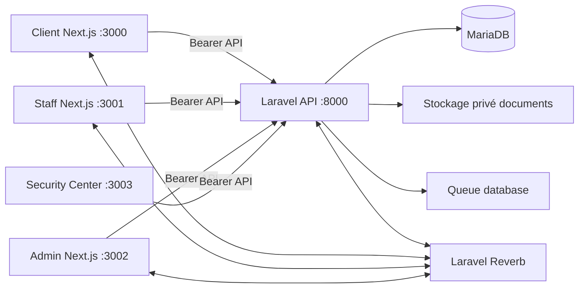

# BTS Bank — audit système complet

Date d'audit : 23 août 2026.  Périmètre : état présent du dépôt, y compris les modifications non validées déjà présentes. Cette phase est strictement documentaire : aucun code, paquet, schéma ou jeu de données n'a été modifié.

## Verdict

BTS Bank est une plateforme Laravel 12 + quatre portails Next.js bien avancée pour la gestion du cycle de vie d'une demande de crédit. Elle possède déjà des protections concrètes : validation serveur, jetons Sanctum courts, rôles/permissions centralisés, isolation d'agence pour les agents affectés, stockage privé des documents, contrôles d'accès aux canaux Reverb, journaux d'activité et générateur synthétique performant.

Elle n'est pas prête pour une production bancaire ou une mise en service d'écritures monétaires. Le principal bloquant objectif est une **dérive entre la migration et le schéma MariaDB** : une installation neuve créerait un `ENUM` de statuts incomplet alors que la base locale est manuellement en `varchar(50)`. La suite de tests SQLite ne peut pas détecter ce problème. Les autres bloqueurs sont l'exposition des jetons aux scripts de la page, l'audit non infalsifiable, l'absence de quarantaine antivirus des documents et des invariants métier/DB insuffisants pour le nouveau grand livre.

## Applications et responsabilités

| Application | Port local | Rôle réel | État d'audit |
|---|---:|---|---|
| `backend/` | 8000 | API Laravel, domaine crédit, auth, documents, rendez-vous, notifications, audit, Reverb, synthétique, prototype ledger | cœur du système |
| `client/` | 3000 | inscription/OTP/Google, dossier crédit, documents, rendez-vous, messagerie, notifications | portail client |
| `staff/` | 3001 | première revue, documents, rendez-vous, rapports et activité d'agence | portail opérationnel |
| `admin/` | 3002 | décision finale, administration et vues d'exploitation | portail administrateur |
| `sc/` | 3003 | Security Center : audit, suspension, télémétrie machine, osquery, scan de ports | portail sécurité séparé |
| `e2e/` | — | parcours Playwright sériel client → staff → admin | non branché à la CI |

Les quatre applications Next.js sont indépendantes. Elles utilisent React 19, Next 16, TypeScript strict, Tailwind 4 et une bibliothèque de composants proche dans chaque portail. Il n'existe pas de package partagé pour l'API, l'authentification, les composants UI ou les types métier.



## Audit frontend

| Surface | Ce qui est bien | Écarts observés | Recommandation |
|---|---|---|---|
| Client | wizard clair, formulaires par étapes, erreurs API typées, upload séparé JSON/FormData, Leaflet | token localStorage, liste dossiers non paginée, guards client-side, nombreux composants dupliqués, pas de tests UI | session sûre, cursor pagination, package API/types/design system et Vitest/Playwright accessibility |
| Staff | revue, documents, rendez-vous, rapports, chargements/erreurs visibles | même client API/telemetry copié, stockage de rôle local, pas de suite composants | extraire primitives partagées et tester branch/role/error states |
| Admin | dashboard, décisions finales, rapports, osquery | client API copié et auth locale; build/runtime dépend de token navigateur; pas de tests UI | même socle partagé, MFA/JIT à terme et décisions idempotentes |
| Security Center | application dédiée, appels API avec AbortSignal, quelques tests Vitest | CORS local 3003 absent du runtime inspecté, token localStorage, informations hôte très sensibles, pas de Reverb | corriger configuration, renforcer session/permissions et séparer télémétrie hôte |

Les portails possèdent des `ApiError` cohérents et les téléchargements staff/admin passent par `Blob`, ce qui est positif. Cependant les mêmes helpers de base URL, token, headers de fingerprint, gestion 401 et composants UI existent trois ou quatre fois. Cette duplication produit une divergence : client résout l'URL par appel, staff/admin la calculent au chargement du module, SC a encore une variante. Un monorepo avec **un petit package partagé** `api-contracts`, `auth-client` et `ui` est souhaitable, à condition de ne déplacer que les éléments réellement identiques.

Toutes les routes sensibles sont finalement autorisées par Laravel, donc les guards React ne constituent pas la sécurité. En revanche, ils ne procurent ni rendu serveur protégé, ni état de session centralisé, ni cache/invalidation de données. Une couche de requêtes/caching ne doit être ajoutée qu'après standardisation de l'API et des invalidations de dossier/notification.

Les `next.config.ts` n'ajoutent pas de headers de production, CSP, politique images ou reporting sécurité : seuls Turbopack et `allowedDevOrigins` sont configurés. Les styles et composants sont modernes, mais aucune vérification automatisée responsive/accessibilité n'existe pour client/staff/admin.

## Backend reconstruit depuis le code

### Modules

| Module | Composants observés | Évaluation |
|---|---|---|
| Identité | `User`, `StaffUser`, OTP, Google OAuth, reset password, Sanctum | séparation client/interne saine ; mode bearer seulement |
| Crédit | `CreditApplicationService`, `CreditApplicationReviewService`, `CreditApplicationStateMachine`, requêtes de formulaire | règles métier majoritairement centralisées, mais invariant DB insuffisant |
| Agences/rendez-vous | `BranchMatchingService`, `AppointmentSchedulingService` | sélection géographique et verrou de ligne agence ; concurrence incomplète au niveau dossier |
| Documents | requêtes upload, `BaseDocumentStorage`, stockage local/S3, vérification locale/Gemini | accès privé robuste ; pas de scan malware/quarantaine |
| Messages/notifications | `ReportMessage`, `AppNotification`, événements Reverb | bon découpage mais diffusion staff O(nombre d'agents) |
| Audit/sécurité | `AuditLogService`, `ActivityLogService`, Security Center, moteur osquery | traçabilité utile, non immuable en base et télémétrie hôte trop couplée à l'API |
| Données synthétiques | `bts:generate-data`, plans de charge, checkpoints, insertions par lots | très bon socle de test ; n'exerce pas les workflows HTTP sous charge |
| Banque | comptes, transactions, lignes comptables, demandes maker/checker | prototype interne prometteur, pas un core banking exploitable |

### Authentification réelle

1. Le client s'inscrit ou se connecte avec mot de passe puis OTP ; Google impose un email vérifié et une vérification de téléphone au premier passage.
2. Les employés ont un modèle séparé et un login distinct. Le Security Center admet `security` ou `admin`.
3. Laravel Sanctum émet des personal access tokens bearer, configurés à 60 minutes dans l'environnement inspecté.
4. Les portails conservent ces jetons dans `localStorage` et les envoient dans `Authorization: Bearer`.
5. Les middlewares séparent explicitement `User` et `StaffUser`; un compte staff suspendu est bloqué à chaque route. Un client suspendu est révoqué par suppression de ses jetons, mais le middleware client ne revérifie pas son état.

L'approche bearer réduit le risque CSRF par rapport à une session cookie, mais transfère le risque majeur vers XSS/localStorage. La configuration Sanctum cookie est présente mais `statefulApi()` n'est volontairement pas activé.

### Autorisation réelle

* `PermissionRegistry` est la source centrale de droits ; `admin` et `super_admin` possèdent tous les droits, `security` possède les droits d'investigation, et `staff` les droits de revue crédit.
* `EnsurePermission`, `EnsureStaffUser`, `EnsureStaffRole` complètent le contrôle contrôleur. `CreditApplicationPolicy` protège l'appartenance du client à son dossier.
* Un employé non privilégié **avec** `branch_id` ne voit et ne traite que les dossiers affectés à son agence. Les `admin`, `super_admin`, `security` et les employés **sans** agence ne sont pas restreints. C'est une décision de modèle dangereuse par défaut : un oubli d'affectation donne un accès global.
* Les contrôleurs protègent également téléchargement document, rapport, rendez-vous et canaux Reverb. Les canaux privés `user`, `application`, `application.report`, `staff`, `admin` sont explicitement autorisés.

### Machine d'état des demandes de crédit

Statuts réellement déclarés dans `CreditApplication` :

```text
DRAFT
 → STEP_1_COMPLETED → STEP_2_COMPLETED → STEP_3_COMPLETED
 → READY_FOR_VALIDATION_1 → VALIDATION_1_COMPLETED → VALIDATION_2
 → FINAL_LOCKED → SUBMITTED
 → STAFF_APPROVED → APPROVED → APPOINTMENT_PROPOSED
                                      ├─ APPOINTMENT_CONFIRMED
                                      └─ APPOINTMENT_LOCKED

Branches terminales : STAFF_REJECTED, REJECTED, CANCELLED
```

Règles observées :

* le client sauvegarde les trois sections, passe les validations, verrouille puis soumet ; l'implémentation conserve une compatibilité de « saut en avant » client dans la chaîne jusqu'à `SUBMITTED`;
* un agent approuve/rejette `SUBMITTED`; un administrateur décide ensuite; l'approbation finale propose immédiatement un rendez-vous;
* les propositions sont append-only, jusqu'à `Appointment::MAX_ATTEMPTS` (5 dans le modèle actuel), puis le dossier est verrouillé pour intervention manuelle;
* les annulations sont terminales et interdites après `FINAL_LOCKED` côté client.

| État source | Cibles autorisées par `CreditApplicationStateMachine` | Acteur |
|---|---|---|
| `DRAFT` | `STEP_1_COMPLETED`, `CANCELLED` | client |
| `STEP_1_COMPLETED` | `STEP_2_COMPLETED`, `CANCELLED` | client |
| `STEP_2_COMPLETED` | `STEP_3_COMPLETED`, `CANCELLED` | client |
| `STEP_3_COMPLETED` | `READY_FOR_VALIDATION_1`, `CANCELLED` | client |
| `READY_FOR_VALIDATION_1` | `VALIDATION_1_COMPLETED`, `CANCELLED` | client |
| `VALIDATION_1_COMPLETED` | `VALIDATION_2`, `CANCELLED` | client |
| `VALIDATION_2` | `FINAL_LOCKED`, `CANCELLED` | client |
| `FINAL_LOCKED` | `SUBMITTED` | client |
| `SUBMITTED` | `STAFF_APPROVED`, `STAFF_REJECTED`, `CANCELLED` | staff |
| `STAFF_APPROVED` | `APPROVED`, `REJECTED`, `APPOINTMENT_*`, `CANCELLED` | admin ; `APPOINTMENT_*` aussi client/staff/admin dans la table |
| `APPROVED` | `APPOINTMENT_PROPOSED`, `APPOINTMENT_CONFIRMED`, `APPOINTMENT_LOCKED` | client/staff/admin |
| `APPOINTMENT_PROPOSED` | même état (nouvelle proposition), `APPOINTMENT_CONFIRMED`, `APPOINTMENT_LOCKED` | client/staff/admin |
| `APPOINTMENT_CONFIRMED` | même état, `APPOINTMENT_PROPOSED` | staff/admin |
| `APPOINTMENT_LOCKED` | `APPOINTMENT_CONFIRMED`, `APPOINTMENT_PROPOSED` | staff/admin |
| `STAFF_REJECTED`, `REJECTED`, `CANCELLED` | aucune | terminal |

En complément de cette table, le code admet un saut strictement avant dans la chaîne client, de n'importe quel statut client vers un statut plus profond jusqu'à `SUBMITTED`. C'est la raison pour laquelle la transition table seule ne doit pas être considérée comme l'unique règle de validation.

**Écart important :** `status` est encore dans `$fillable` de `CreditApplication`, contrairement au commentaire affirmant que la machine en est l'unique écrivain. De plus, les sauts avant ne prouvent pas la complétude de chaque étape. La machine doit devenir le seul point d'écriture et recevoir des préconditions métier explicites.

### Documents

Les uploads sont validés par type configuré, taille, extension et inspection MIME par `finfo`. Le chemin est généré côté serveur et isolé par dossier de demande. Les documents ne sont jamais exposés par URL publique : les contrôleurs streament le fichier après contrôle d'appartenance/branche. La configuration supporte un disque S3-compatible sans changement de code.

La vérification est locale par défaut ; Gemini est optionnel et l'IA reste consultative. Une erreur fournisseur est enregistrée et ne contourne pas le processus. Il n'y a ni quarantaine, ni antivirus, ni contrôle de contenu profond avant que le fichier soit conservé et consultable.

### Rendez-vous et agences

Le matching privilégie coordonnées, puis délégation, ville/gouvernorat et agence par défaut. La proposition verrouille la ligne `branches` et cherche une place libre en excluant les rendez-vous rejetés/annulés. Ce verrou sérialise l'allocation pour une agence, et les tests couvrent des attributions concurrentes entre demandes.

Risques restants : pas d'unicité DB `(branch_id, scheduled_date, scheduled_time)` pour une place active, pas d'unicité `(credit_application_id, attempt_number)`, et acceptation/rejet d'une même proposition sans verrou pessimiste sur rendez-vous/dossier. Une double requête peut donc produire des décisions concurrentes malgré le verrou d'agence.

### Temps réel, queue et tâches planifiées

Reverb est prévu et les événements de notification/message sont diffusés sur des canaux privés. Ils utilisent toutefois `ShouldBroadcastNow`, donc le HTTP peut attendre la diffusion. L'environnement inspecté utilise queue/cache **database** et Reverb. Il n'y a pas de planification métier dans `routes/console.php`, pas de supervision des workers, ni Horizon.

### Security Center / « osquery »

Le SC permet à `security`/`admin` de voir audit, données de conformité, utilisateurs/tokens, télémétrie, ports et exports. `OsqueryService` accepte seulement `SELECT`/`PRAGMA` et interdit les mots destructifs ; le chemin natif protège l'argument shell avec `escapeshellarg`.

Ce n'est pas un agent osquery centralisé : le fallback est un moteur PHP qui invoque PowerShell/netstat sur **l'hôte de l'API**, puis met en mémoire au plus 200 audits. Le tableau de vulnérabilités est une règle de ports ciblée, pas un scanner de vulnérabilités CVE. Il ne faut donc pas le présenter comme une capacité EDR/SIEM ou une couverture osquery de parc.

### Générateur synthétique

`bts:generate-data` offre les profils `small`, `medium`, `large`, `massive`, les options seed/nombre, des identités `.invalid`, une protection production, un verrou global, points de reprise, transactions par chunks et batch inserts. Les objectifs configurés atteignent 1M de clients et des millions d'applications, sans désactiver les clés étrangères. Les chemins d'état sont générés à partir des constantes réelles.

Il faut tout de même benchmarker MariaDB sur le matériel cible, mesurer disque/index/binlog et tester l'API avec un moteur de charge. Ce générateur insère directement des lignes : il ne vérifie pas la capacité de Reverb, rate limiting, upload ou workers sous trafic réel.

## Forces principales

1. Séparation claire `User` / `StaffUser` et contrôles de type sur les routes.
2. Form Requests et validation serveur largement employés.
3. Numéros de dossier générés sous transaction avec verrou de compteur.
4. Stockage privé, noms de fichiers non prédictibles, accès contrôlé et tests de traversée/MIME.
5. Écriture de statut, décisions et rendez-vous auditée de façon régulière.
6. Matrice permissions, isolation d'agence et autorisation Reverb testées.
7. Générateur de charge synthétique responsable, reprenable et déterministe.
8. Tests backend substantiels : 355 tests / 2 836 assertions lors de l'audit.
9. Headers API défensifs et erreurs JSON cohérentes avec `request_id`.
10. Première base de double écriture/idempotence/maker-checker dans le ledger.

## Écarts prioritaires

| Priorité | Écart prouvé | Impact |
|---|---|---|
| P0 | migration `credit_applications` = ENUM limité ; schéma MariaDB local = `varchar(50)` sans migration qui explique le changement | une base neuve MariaDB ne peut pas parcourir les statuts de revue/rendez-vous ; déploiement non reproductible |
| P0 | module ledger ne fournit qu'un prototype interne ; aucun invariant DB de somme débit=crédit, pas de correction par contre-écriture, rapprochement, période comptable, rails externes ou opérations | ne pas utiliser pour fonds réels |
| P1 | jetons bearer dans `localStorage` dans les quatre portails | XSS = vol de session client, staff, admin ou sécurité |
| P1 | audit table modifiable par le compte applicatif et sans chaînage/scellement/rétention | journal non probant pour conformité/enquête |
| P1 | utilisateur staff sans agence = accès global | échec de moindre privilège par erreur de configuration |
| P1 | absence de scan malware/quarantaine et fallback MIME permissif | fichiers malveillants ou incohérents peuvent être stockés/servis |
| P1 | notifications staff synchrones et diffusées à tous les agents actifs | fuite de métadonnées et coût linéaire à chaque événement |
| P1 | portail SC absent de `CORS_ALLOWED_ORIGINS` effectif local (3003) | le portail sécurité ne peut pas joindre directement l'API locale |
| P2 | quatre implémentations API/auth/UI et pas de tests de composants client/staff/admin | régressions et divergence UX |
| P2 | CI sans SC, Playwright, MariaDB, formatage, analyse statique, secret/SBOM/scans | confiance de livraison insuffisante |

Les détails classés et les corrections proposées figurent dans les autres rapports de ce dossier.

## Preuves et limites

* L'audit a lu routes, modèles, migrations, services, middlewares, configurations, dépendances, CI et tests. La base locale contient 28 tables et ses migrations sont déclarées appliquées.
* Contrôles exécutés sans modification : `php artisan test --compact` (355 réussites), `npx tsc --noEmit` dans les quatre portails (réussites), `npm test` dans `sc` (6 réussites), `composer audit --locked` et `npm audit --omit=dev --audit-level=high` dans les quatre portails (0 vulnérabilité signalée).
* Les E2E Playwright n'ont pas été lancés : ils exigent une base MySQL partagée et écrivent des comptes/fichiers/logs. Aucun test de charge, scan actif ZAP, scan de secrets ni benchmark MariaDB n'a été exécuté dans cette phase documentaire.
