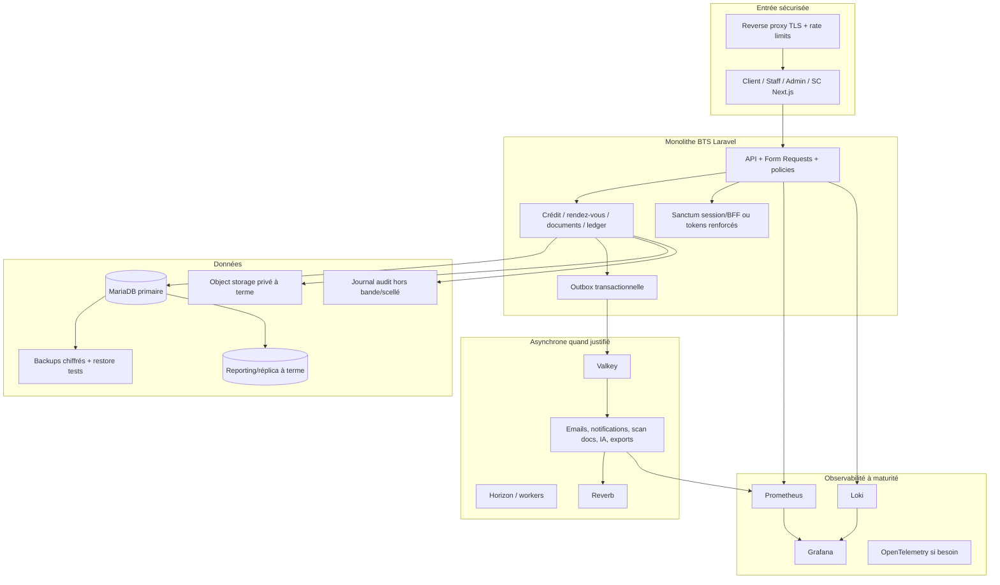
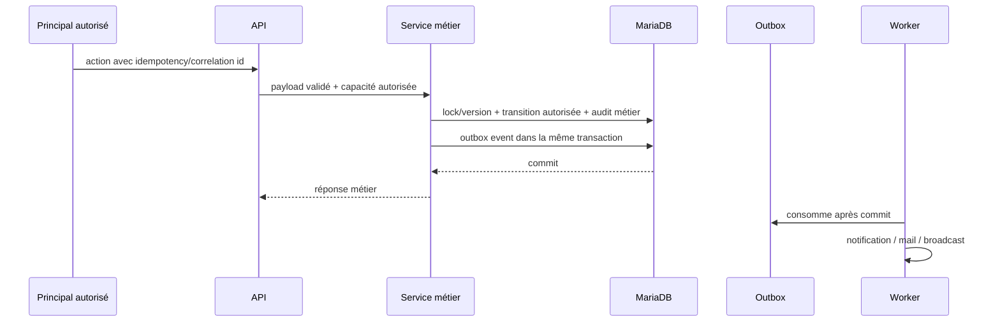
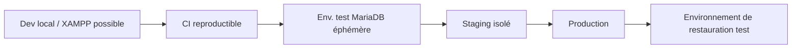

# BTS Bank — architecture cible progressive

## Principe directeur

Préserver le monolithe Laravel et les quatre portails tant que les mesures ne prouvent pas un besoin de découpage. La cible n'est pas une collection d'outils : chaque composant ci-dessous répond à une lacune identifiée et peut être introduit indépendamment.

## Architecture cible par couches

## Décisions d'architecture

| Décision | Cible | Pourquoi | Déclencheur | À ne pas faire |
|---|---|---|---|---|
| Topologie | monolithe Laravel modulaire | domaine cohérent, transactions locales, équipe/projet actuel | maintenant | microservices par défaut |
| Auth web | BFF/cookies HttpOnly ou bearer mémoire à rotation | retirer vol de `localStorage` | P1 sécurité | mélanger deux stratégies sans CSRF/session design |
| Autorisation | registry/policies conservés, deny-by-default | règle agence et métier spécifique | P1 | remplacer mécaniquement par RBAC générique |
| État crédit | machine unique avec préconditions/version | intégrité et concurrence | P0 | status mass assignable / sauts sans validation |
| Documents | storage privé + quarantine + scan + statut | réduire malware et préserver accès | P1 | rendre public/signer des URLs sans policy |
| Realtime | Reverb gardé, diffusion asynchrone | déjà intégré et adapté | P1 | synchroniser des milliers de broadcasts HTTP |
| Queue/cache | DB maintenant, Valkey + Horizon à charge justifiée | workers/notifications sont le premier vrai besoin | P1/P2 | introduire cluster Redis sans jobs à traiter |
| MariaDB | conserver MariaDB | compatible domaine et XAMPP/déploiement ; le problème est le drift/ops | maintenant | migrer de SGBD sans benchmark/besoin |
| Ledger | domaine isolé, expérimental | empêcher confusion avec core banking | P0 | exposer aux clients/fonds réels avant validation externe |
| Analytics | API agrégée native bornée maintenant; read model/réplica + Metabase si charge prouvée | répondre au besoin sans exposer PII/credentials ni distribuer prématurément | Phase 6 mesurée puis seuil de contention/BI récurrente | BI avec compte applicatif/migration ou requêtes brutes non bornées sur primaire |
| Observabilité | logs/métriques d'abord, traces ensuite | besoins immédiats connus | P2 | SIEM/APM lourd mono-machine sans critères |

## Flux cibles critiques

### 1. Changement de statut de demande

Les préconditions métier sont évaluées avant l'écriture, la transition est contrôlée, et les effets secondaires n'allongent pas la transaction utilisateur. Cette architecture doit être introduite après correction du schéma P0, sans modifier les règles fonctionnelles validées.

### 2. Document entrant

1. Le serveur valide taille/type apparent et écrit dans une zone privée de quarantaine avec un nom généré.
2. Une transaction crée le metadata document `pending_scan` sans le rendre téléchargeable.
3. Un job isolé effectue scan antivirus, validation de contenu et éventuellement analyse OCR/IA déclarée.
4. Seul le verdict `clean` rend le document accessible aux rôles autorisés; `rejected` conserve un minimum d'évidence, pas le fichier dangereux.
5. Chaque étape est auditée et idempotente. Les échecs/retries sont visibles dans la queue.

### 3. Audit et conformité

* L'audit métier reste près du domaine pour conserver contexte/correlation id.
* Une copie structurée est exportée vers un stockage/collecteur hors bande à accès écriture seul pour l'application.
* Un hash-chain ou scellement par lot détecte l'altération; le compte applicatif n'a pas UPDATE/DELETE sur les événements finalisés.
* Les logs techniques (Loki) sont séparés du journal probant; leurs rétentions et accès diffèrent.

## Sécurité cible

| Surface | Contrôle cible |
|---|---|
| Edge | TLS forcé, HSTS au proxy, WAF/rate limit, origin allow-list, secrets jamais dans bundle |
| Browser | CSP avec nonce, `frame-ancestors 'none'`, session HttpOnly/rotation, aucune donnée sensible persistée inutilement |
| API | Form Requests, policies, `request_id`, idempotency sur opérations d'écriture, version/concurrence, erreurs sans détails internes |
| Privileges | MFA/JIT pour admin/security, affectation agence obligatoire sauf rôle global approuvé, revue périodique des droits |
| DB | comptes séparés app/migration/lecture/audit, chiffrement/TLS, backups restores, migrations seules |
| Documents | quarantine, antivirus, contenu borné, chiffrement de stockage, téléchargement autorisé et journalisé |
| Operations | SBOM/secrets/dependency scan, revue ASVS, alertes et runbooks |

## Livraison et environnements

* **Local :** XAMPP/MariaDB 3306 reste possible. Ne jamais confondre sa configuration (debug, disque local, queue database) avec la prod.
* **CI :** migration MariaDB fraîche + tests, quatre frontends, E2E isolé, scans supply-chain.
* **Staging :** mêmes migrations/configuration de service, données uniquement synthétiques/masquées, ZAP/k6 contrôlés.
* **Production :** reverse proxy TLS, workers supervisés, sauvegardes, monitoring, secrets et comptes DB restreints.
* **DR :** restauration régulièrement testée DB + documents + clé/chiffrement ; métriques RPO/RTO observées.

## À ne pas introduire maintenant

1. Kubernetes, service mesh, Kafka ou microservices : aucun goulot de couplage ou volume ne les justifie aujourd'hui.
2. Elasticsearch/Meilisearch/Typesense : les recherches actuelles doivent d'abord être paginées/indexées et mesurées dans MariaDB.
3. Superset/Metabase directement sur la primaire : la Phase 6 couvre le besoin par API agrégée; toute BI future passe par vues/read model minimisés et compte readonly, de préférence sur réplica/reporting DB.
4. Object storage distribué : le driver S3-compatible existe ; le disque privé reste suffisant tant que volume, HA et reprise ne l'imposent pas.
5. Tracing distribué complet : OpenTelemetry a de la valeur avec workers/services, pas comme cosmétique sur une instance unique.

## Indicateurs de décision

| Signal mesuré | Décision possible |
|---|---|
| backlog jobs, retries ou mail/scan ralentit HTTP | Valkey + Horizon + outbox |
| p95 dashboard/audit ou lock DB dépasse budget | indexes/archives/read model avant nouvelle base |
| volume documents/reprise locale ne satisfait RPO/RTO | stockage S3-compatible privé + lifecycle |
| erreurs distribuées difficiles à corréler | OpenTelemetry/collector |
| demandes de BI récurrentes et validées ou analytics qui dégrade OLTP | réplica/read-model + Metabase avec compte readonly et vues approuvées |
| besoin full-text mesuré malgré indexes MariaDB | benchmark Meilisearch sur données minimisées |
