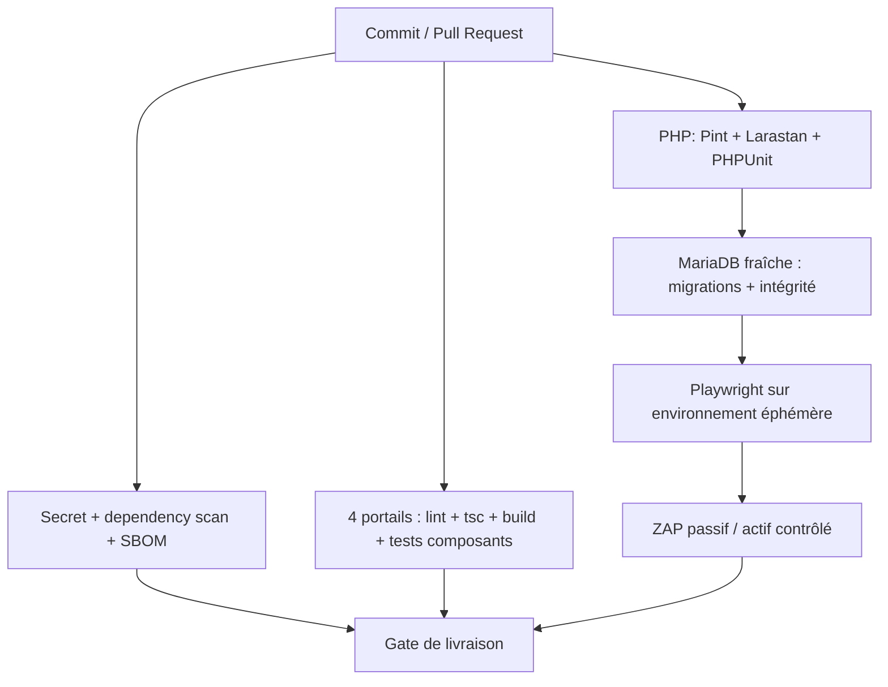

# BTS Bank — audit tests et lacunes de vérification

## État constaté

Le backend possède une suite PHP solide et orientée domaine. L'exécution documentaire a réussi : **355 tests, 2 836 assertions, 36,68 s**. Elle couvre authentification, OTP, crédit, documents, rendez-vous, rôles, branches, Reverb, notifications, Security Center, generator synthétique et ledger.

La couverture est cependant très déséquilibrée : aucune suite de composants/unit frontend dans `client`, `staff` ou `admin`; seulement 2 fichiers Vitest dans `sc` (6 tests réussis). Les quatre scénarios Playwright existent mais ne sont pas lancés par CI et partagent un état MySQL externe sériel.

## Matrice de couverture

| Domaine | Couverture actuelle | Évaluation | Lacune principale |
|---|---|---|---|
| Inscription/login/reset/OTP/Google | tests Feature complets, cas expiré/erreur/énumération | forte | MFA pour rôles privilégiés, tests sessions multiples/navigateurs et abus rate-limit distribués |
| Sanctum/headers/health | token expiration, logout, headers, request id | bonne | tests token volé/XSS impossibles sans stratégie frontend, CORS SC absent |
| Permissions/branches | matrice, customers/staff/admin, branch staff et channels | bonne localement | deny-by-default employé sans agence et couverture `security`/`super_admin` complète |
| Machine de crédit | chaine, rejet, annulation, audit, verrouillage | bonne mais trompeuse sur DB | MariaDB réel et valeurs ENUM, sauts client impossibles, optimistic locking |
| Documents | taille/type/MIME, isolation, download, IA locale/Gemini | bonne | malware/quarantaine, archives, fichiers corrompus, restauration stockage/DB |
| Rendez-vous | matching, capacité, rejets, cas concurrence par agence | bonne | accept/reject simultané du même rendez-vous, double click/retry, contraintes DB |
| Messages/rapports | ownership, tour de parole, attachment, Reverb failure | moyenne | pagination, content security, fermeture/archivage, permissions de rôle futur |
| Notifications | inbox, dedupe, staff/admin, broadcast | moyenne | charge à 10K agents, visibilité par agence, idempotence after-commit, retry jobs |
| Reverb | autorisations de channels | moyenne | serveur Reverb réel, reconnect, token expiré, backpressure et failover |
| Security Center/osquery | auth, suspension, query, scan | moyenne | red team non intrusive, limites/timeout, RBAC/JIT/MFA, données hôte minimisées |
| Ledger | balance en service, idempotence, maker/checker | début prometteur | DB invariant, reversals, coupure/failure/retry, rapprochement, audit comptable |
| Synthetic big data | seed, état, integrity, command safety | bonne | benchmark MariaDB, resume après crash réel, disque/index/binlog, API load |
| Frontends | TypeScript strict passe dans les 4 | très faible | rendu, accessibilité, validation, erreurs, auth, responsive, API mocks/contracts |
| E2E | 4 scénarios client→staff→admin | utile mais non industrialisé | isolation, fixtures propres, SC, CI, retries, traces et tests négatifs |
| CI/CD | backend PHP + client/staff/admin lint/tsc/build/audits | base saine | SC, Pint, Larastan, MariaDB, Playwright, secret/SBOM/ZAP |

## Problème P0 : faux sentiment de sécurité SQLite

La CI exécute migrations/tests backend sous SQLite. La migration versionnée de `credit_applications.status` crée un ENUM ne contenant pas les statuts de staff/admin/rendez-vous, tandis que le schéma MariaDB local est un varchar modifié hors migration. SQLite n'applique pas l'ENUM MySQL de la même manière : les 355 tests verts ne prouvent pas qu'une base MariaDB neuve fonctionne.

**Test à ajouter en premier :** job CI MariaDB, création de base vide, `php artisan migrate --force`, parcours `DRAFT → APPOINTMENT_*`, puis vérification des FKs/index/contraintes. Il doit être bloquant.

## Tests futurs prioritaires

### P0

1. migration MariaDB fraîche et schéma reproductible ; test de tous les statuts déclarés.
2. service/middleware : un status ne peut jamais arriver par mass assignment ou saut HTTP non autorisé.
3. tests concurrentiels : double accept/reject du même rendez-vous, soumission/retry et création de créneau sous charge.
4. ledger : crash entre transaction/lignes, somme des écritures, idempotency key concurrente, contrôle maker ≠ checker, correction par reversal.

### P1

1. permission property tests/matrice exhaustive pour `staff`, `credit_officer`, `senior_staff`, `branch_manager`, `security`, `admin`, `super_admin`, avec et sans agence.
2. tests CORS pour 3000–3003 et `localhost`/`127.0.0.1`; E2E SC login/audit/suspension autorisée/refusée.
3. tests de quarantaine antivirus, validation de contenu, erreurs de stockage et rollback DB/fichier.
4. tests notification outbox/queue, visiblité agence, retry et aucune duplication.
5. tests de charge/contrat API sur dataset synthétique, puis tests réels k6 isolés.
6. tests d'accessibilité Playwright/axe des formulaires et de navigation clavier dans les quatre portails.

### P2

1. visual regression des composants de formulaire/table/modal/cards ; mobile/desktop.
2. tests de pagination cursor, recherche et exports sur millions de lignes synthétiques.
3. test de restauration sauvegarde DB/documents et rétention/purge.
4. chaos tests contrôlés : Reverb indisponible, queue lente, provider mail/IA indisponible, MariaDB restart.

## Plan de qualité CI cible

| Étape | Outil/fonction | Mode | Bloquant |
|---|---|---|---|
| format PHP | Laravel Pint existant | local + CI | oui |
| analyse PHP | Larastan/PHPStan | niveau progressif | oui après baseline |
| tests PHP | PHPUnit existant | SQLite rapide + MariaDB intégration | oui |
| frontend | ESLint, `tsc --noEmit`, build | client/staff/admin/sc | oui |
| UI | Vitest + Testing Library à ajouter | composants critiques | oui |
| E2E | Playwright existant | DB/base isolée et fixtures contrôlées | oui pour parcours critique |
| secrets | Gitleaks ou TruffleHog | commits + worktree | oui |
| dépendances | Composer audit, npm audit, SBOM Syft | manifests/lockfiles | oui avec politique d'exception |
| DAST | OWASP ZAP | staging/PR isolé, règles allow-list | rapport d'abord, blocage après tuning |

Gitleaks peut scanner un dépôt Git, un répertoire ou stdin et produire un baseline pour ne bloquer que les nouveaux écarts ([documentation](https://github.com/gitleaks/gitleaks)). Syft génère une SBOM pour écosystèmes dont PHP et JavaScript, sous Apache-2.0 ([Syft](https://github.com/anchore/syft/blob/main/README.md?plain=1)).

## Exécution effectuée pendant cet audit

| Commande | Résultat |
|---|---|
| `backend/php artisan test --compact` | 355 tests, 2 836 assertions réussis |
| `client|staff|admin|sc: npx tsc --noEmit` | réussi dans les 4 portails |
| `sc/npm test -- --run` | 2 fichiers, 6 tests réussis |
| `backend/composer audit --locked` | aucune alerte de vulnérabilité |
| `client|staff|admin|sc: npm audit --omit=dev --audit-level=high` | 0 vulnérabilité signalée |
| `php artisan migrate:status` + lecture MariaDB | migrations déclarées appliquées, drift de `status` confirmé |

Les E2E n'ont volontairement pas été lancés : ils créent des comptes, lisent/écrivent log et fichier d'état, et exigent une base MySQL partagée. Aucun scan actif ni test de charge n'a été exécuté.

## Critères de sortie phase qualité

* aucun P0 de migration MariaDB ou de concurrence;
* toutes les applications passent les checks dans la même CI;
* E2E isolé, rejouable et non dépendant d'un ordre global implicite;
* tests négatifs d'autorisation pour chaque rôle/branche;
* evidence automatisée de lint/type/test/dependency/secret/SBOM conservée par release;
* régression UX/accessibilité couverte sur les formulaires et opérations à risque.
