# BTS Bank

## Plateforme de gestion des demandes de crédit et pilote de services bancaires

### Rapport de projet de fin d’études

**Réalisé par :** [À confirmer]  
**Établissement :** [À confirmer]  
**Filière / diplôme :** [À confirmer]  
**Encadrant académique :** [À confirmer]  
**Encadrant professionnel :** [À confirmer]  
**Organisme d’accueil :** [À confirmer]  
**Année universitaire :** 2025–2026  
**Date et lieu de soutenance :** [À confirmer]

> **Note de positionnement.** « BTS Bank » est le nom du projet logiciel étudié. Le présent rapport ne revendique aucune affiliation bancaire ou institutionnelle officielle. Le dépôt décrit un prototype avancé de traitement des demandes de crédit, complété par un pilote de registre comptable. Il ne constitue pas, dans son état audité, un système bancaire de production.

---

## Autorisation et visa

Le présent document est destiné à l’évaluation académique du projet BTS Bank. Les noms, signatures, cachets, autorisations de diffusion et éventuelles restrictions de confidentialité doivent être complétés par les parties concernées.

| Visa | Nom | Date | Signature |
|---|---|---|---|
| Étudiant | [À confirmer] | [À confirmer] |  |
| Encadrant académique | [À confirmer] | [À confirmer] |  |
| Encadrant professionnel | [À confirmer] | [À confirmer] |  |
| Responsable de jury | [À confirmer] | [À confirmer] |  |

---

## Remerciements

Je remercie les personnes qui ont contribué à l’encadrement, à la relecture et à l’évaluation de ce travail. Une version déposée auprès de l’établissement devra remplacer ce paragraphe par des remerciements personnalisés et validés, notamment les noms de l’organisme d’accueil, des encadrants et des membres du jury.

## Dédicace

À ma famille, à mes enseignants et à toutes les personnes qui m’ont soutenu pendant la réalisation de ce projet. Cette dédicace peut être personnalisée avant la remise officielle.

---

## Résumé

BTS Bank est une plateforme web de gestion du cycle de vie d’une demande de crédit. Elle réunit quatre portails — client, personnel d’agence, administration et centre de sécurité — autour d’une API Laravel. Le client s’inscrit avec vérification OTP ou identité Google, complète un dossier en plusieurs étapes, dépose ses justificatifs, déclenche des contrôles et suit les décisions. Le personnel examine les dossiers de son agence, l’administration prend la décision finale, puis un rendez-vous peut être proposé et confirmé. Un espace de rapport permet les échanges liés au dossier. Le système comporte également des notifications asynchrones, des journaux d’audit chaînés, des contrôles de fichiers, des analyses, des outils de génération de données synthétiques, des tests de charge et un pilote de registre comptable en partie double.

La réalisation repose sur Laravel 12.66.0, PHP 8.2.12, MariaDB 10.4.32, Next.js 16.3.0, React 19.2.8 et Tailwind CSS 4. L’audit final a recensé 104 routes, 51 migrations, 21 modèles Eloquent, 31 contrôleurs, 60 services et 64 fichiers de tests backend. La campagne de validation a obtenu 427 tests Laravel réussis et 3 tests réservés à MariaDB ignorés dans le runner standard, puis 3 tests de concurrence MariaDB réussis. Les quatre portails satisfont leurs contrôles de lint, de types et de build, tandis que la campagne Playwright isolée réussit 10 scénarios sur 10.

Ces résultats démontrent une base fonctionnelle solide pour une démonstration avec données synthétiques. Ils ne prouvent cependant ni une disponibilité bancaire, ni une conformité réglementaire, ni une reprise après sinistre de niveau production. L’audit final conserve 13 constats de gravité haute, 16 moyens, 5 faibles et 2 informatifs. Les priorités sont la correction des autorisations de workflow et de branche, l’authentification multifacteur des comptes privilégiés, la robustesse documentaire, l’immutabilité externe des audits, la reproductibilité des releases et la validation d’un plan de reprise.

**Mots-clés :** demande de crédit, Laravel, Next.js, workflow, contrôle d’accès, sécurité documentaire, temps réel, observabilité, données synthétiques, registre comptable.

## Abstract

BTS Bank is a web platform that manages the lifecycle of a credit application. Four portals — customer, branch staff, administration, and security center — interact with a Laravel API. Customers register through OTP verification or Google identity, complete a multi-step application, upload supporting documents, run validations, and follow decisions. Branch staff review applications within their assigned branch, administrators perform the final decision, and an appointment may then be proposed and confirmed. A report area supports application-related discussions. The platform also includes asynchronous notifications, chained audit records, file-security controls, analytics, synthetic-data generation, load testing, and a double-entry ledger pilot.

The implementation uses Laravel 12.66.0, PHP 8.2.12, MariaDB 10.4.32, Next.js 16.3.0, React 19.2.8, and Tailwind CSS 4. The final audit identified 104 routes, 51 migrations, 21 Eloquent models, 31 controllers, 60 services, and 64 backend test files. Validation produced 427 passing Laravel tests with three MariaDB-only tests skipped by the standard runner, followed by three passing MariaDB concurrency tests. All four portals passed lint, type, and build checks, and the isolated Playwright campaign passed all 10 scenarios.

The result is a credible demonstration platform using isolated synthetic data. It is not evidence of bank-grade production readiness, regulatory compliance, or high availability. The final audit still reports 13 high, 16 medium, 5 low, and 2 informational findings. The main priorities are workflow and branch-authorization corrections, privileged MFA, stronger document consistency, independently immutable audit evidence, reproducible releases, and a proven disaster-recovery plan.

**Keywords:** credit application, Laravel, Next.js, workflow, access control, document security, real time, observability, synthetic data, ledger.

---

## Liste des acronymes

| Acronyme | Signification |
|---|---|
| API | Application Programming Interface |
| CI/CD | Intégration continue et livraison/déploiement continu |
| CSP | Content Security Policy |
| DR | Disaster Recovery, reprise après sinistre |
| E2E | End-to-End, test de bout en bout |
| ERD | Entity Relationship Diagram |
| FK | Foreign Key, clé étrangère |
| HMAC | Hash-based Message Authentication Code |
| IA | Intelligence artificielle |
| MFA | Multi-Factor Authentication |
| ORM | Object-Relational Mapping |
| OTP | One-Time Password |
| PII | Personally Identifiable Information |
| RBAC | Role-Based Access Control |
| RPO | Recovery Point Objective |
| RTO | Recovery Time Objective |
| SLA | Service Level Agreement |
| UML | Unified Modeling Language |
| VU | Virtual User |

## Table des matières

1. [Introduction générale](#introduction-générale)
2. [Chapitre 1 — Contexte, besoins et spécifications](#chapitre-1--contexte-besoins-et-spécifications)
3. [Chapitre 2 — Analyse et conception](#chapitre-2--analyse-et-conception)
4. [Chapitre 3 — Réalisation](#chapitre-3--réalisation)
5. [Chapitre 4 — Validation, performance et résultats](#chapitre-4--validation-performance-et-résultats)
6. [Chapitre 5 — Sécurité, qualité et exploitation](#chapitre-5--sécurité-qualité-et-exploitation)
7. [Conclusion générale et perspectives](#conclusion-générale-et-perspectives)
8. [Annexes](#annexes)

## Liste des figures

1. Cas d’utilisation par acteur
2. Architecture logique globale
3. Modèle relationnel principal
4. Machine d’états de la demande de crédit
5. Séquence d’authentification et d’onboarding
6. Séquence de constitution du dossier et d’analyse documentaire
7. Séquence de double décision et de rendez-vous
8. Diagramme de classes et services principaux
9. Topologie de déploiement observée
10. Messagerie de rapport en temps réel
11. Notifications asynchrones et observabilité
12. Données synthétiques, charge et analytics
13. CI/CD, sauvegarde et restauration
14. Pipeline de sécurité documentaire

## Liste des tableaux

1. Acteurs et responsabilités
2. Exigences fonctionnelles
3. Exigences non fonctionnelles
4. Périmètre démontré et périmètre exclu
5. Modules de l’architecture
6. Dictionnaire des entités métier principales
7. Statuts et responsabilités de transition
8. Principes de conception de sécurité
9. Technologies réellement vérifiées
10. Structure des quatre portails
11. Parcours de réalisation principal
12. Plan de captures d’écran
13. Résultats de validation
14. Profils de données synthétiques
15. Mesures de performance disponibles
16. Contrôles de sécurité et limites
17. Matrice de préparation opérationnelle
18. Backlog de correction priorisé
19. Cartographie synthétique des routes
20. Éléments restant à confirmer

---

# Introduction générale

La gestion d’une demande de crédit combine des données personnelles, une description financière, des justificatifs, des décisions successives et des contraintes d’agence. Lorsque ces éléments sont dispersés entre formulaires, courriels et traitements manuels, la traçabilité devient difficile : une pièce peut être perdue, une décision appliquée hors séquence, un rendez-vous attribué sans capacité disponible ou une donnée consultée au-delà du périmètre autorisé. Un projet numérique crédible doit donc traiter simultanément l’expérience du client, la cohérence du workflow, l’autorisation, la sécurité documentaire, l’auditabilité et l’exploitabilité.

Le projet BTS Bank répond à ce besoin par une plateforme modulaire centrée sur le dossier de crédit. Son apport principal n’est pas de simuler une banque complète, mais d’orchestrer un processus vérifiable depuis l’inscription jusqu’au rendez-vous. Les portails spécialisés limitent les responsabilités visibles pour chaque acteur. Le backend porte les règles transactionnelles, les contrôles de propriété et de branche, la machine d’états, les validations, les notifications, l’audit, l’analytique et les tâches asynchrones. Un module bancaire additif démontre par ailleurs les principes de comptes, d’écritures équilibrées et de validation maker-checker sans prétendre couvrir les fonctions d’un cœur bancaire réglementé.

La méthode suivie dans ce rapport est fondée sur les preuves du dépôt courant : code source, 51 migrations, routes générées, tests, rapports d’audit et mesures enregistrées. Le rapport de référence joint a servi uniquement de modèle de structure académique — couverture, chapitres, dictionnaire de données, diagrammes et conclusion — sans réutilisation de son contenu métier. Toute information non établie par le dépôt est signalée « À confirmer ». Les captures d’interface absentes ne sont pas inventées : des emplacements et instructions de capture sont fournis.

Le premier chapitre formalise le contexte et les besoins. Le deuxième présente l’analyse, l’architecture, le modèle de données et les workflows. Le troisième décrit la réalisation. Le quatrième expose les tests et mesures. Le cinquième analyse la sécurité, la qualité et la préparation opérationnelle. La conclusion synthétise les apports et les perspectives.

---

# Chapitre 1 — Contexte, besoins et spécifications

## 1.1 Introduction et contexte du projet

Une demande de crédit est un objet métier long : elle évolue pendant plusieurs sessions, associe une identité, une demande financière, un projet, des documents et des décisions. Le client attend un parcours compréhensible et un suivi transparent. Le personnel attend une file de travail fiable, filtrée par agence. L’administrateur doit arbitrer les décisions finales. Le centre de sécurité doit observer les événements sans obtenir implicitement des droits métier de mutation.

Le dépôt montre que le projet a progressivement élargi ce noyau. Des fonctions d’authentification, de rendez-vous, de discussion, de notification, d’analytics, de sécurité documentaire, d’observabilité et de génération de charge ont été ajoutées. Cette richesse impose une délimitation stricte : la démonstration peut montrer un processus complet avec données synthétiques, mais elle ne doit pas être présentée comme un service bancaire réel.

## 1.2 Étude de l’existant

Dans un traitement conventionnel ou partiellement manuel, le demandeur répète parfois les mêmes informations sur plusieurs supports. Les pièces sont reçues par des canaux hétérogènes, l’état du dossier est difficile à connaître, et les décisions dépendent de transmissions entre équipes. Une feuille de calcul peut suivre une file, mais elle ne fournit pas naturellement une propriété forte, une machine d’états, un contrôle concurrent de capacité ou une preuve d’audit. Un échange par courriel facilite la communication, mais mélange la pièce, la discussion et la décision et rend la rétention difficile à gouverner.

Cette étude n’affirme pas décrire les pratiques d’un organisme particulier. Elle sert de contexte générique au projet. L’existant logiciel observé dans le dépôt avant les dernières phases avait déjà les portails et le workflow principal, mais manquait de plusieurs garanties ensuite ajoutées : contrôles documentaires structurés, outbox, chaîne d’audit, analytics mesurés, génération synthétique protégée et preuve de restauration.

## 1.3 Problématique

La problématique peut être formulée ainsi : **comment construire une plateforme multiportail qui guide le client dans la constitution d’une demande de crédit, impose l’ordre des validations et décisions, protège les documents, cloisonne les données par rôle et agence, et fournisse des preuves de fonctionnement mesurables ?**

Cette problématique entraîne cinq enjeux :

- conserver un dossier cohérent malgré les saisies progressives et les accès concurrents ;
- garantir qu’une décision ou un rendez-vous n’est possible qu’au bon état ;
- limiter chaque accès à la propriété, au rôle, à la permission et, si nécessaire, à l’agence ;
- traiter les fichiers non fiables sans confondre analyse IA et preuve d’authenticité ;
- rendre la plateforme observable, testable et restaurable.

## 1.4 Solution proposée

La solution proposée regroupe quatre interfaces spécialisées autour d’une API unique. Le portail client guide l’inscription et la saisie. Le portail staff fournit la file de l’agence, la revue et le rendez-vous. Le portail admin porte la décision finale et les vues globales autorisées. Le Security Center observe les événements et les comptes selon des permissions de sécurité. Laravel centralise les règles, MariaDB les données relationnelles, et Reverb/queue/outbox portent les événements temps réel et asynchrones. Cette centralisation permet de faire respecter les mêmes invariants quel que soit le portail appelant.

## 1.5 Acteurs

**Tableau 1 — Acteurs et responsabilités**

| Acteur | Responsabilités principales | Périmètre attendu |
|---|---|---|
| Client | Inscription, OTP, dossier, documents, validations, soumission, rendez-vous, rapport, consultation bancaire | Ses propres ressources |
| Personnel d’agence | Revue documentaire, décision initiale, rapport, proposition de rendez-vous, analytics | Agence affectée |
| Administrateur | Décision finale, vue globale, pilotage et analytics | Ensemble autorisé de la plateforme |
| Centre de sécurité | Observation de l’activité, comptes, télémétrie et contrôles | Lecture et actions de sécurité explicitement autorisées |
| Super-administrateur / rôles internes | Fonctions étendues et pilote bancaire | Périmètre défini par permission |
| Systèmes externes | Google Identity, fournisseur SMS/courriel, Gemini, ClamAV, stockage compatible S3 | Intégrations configurées et contrôlées |

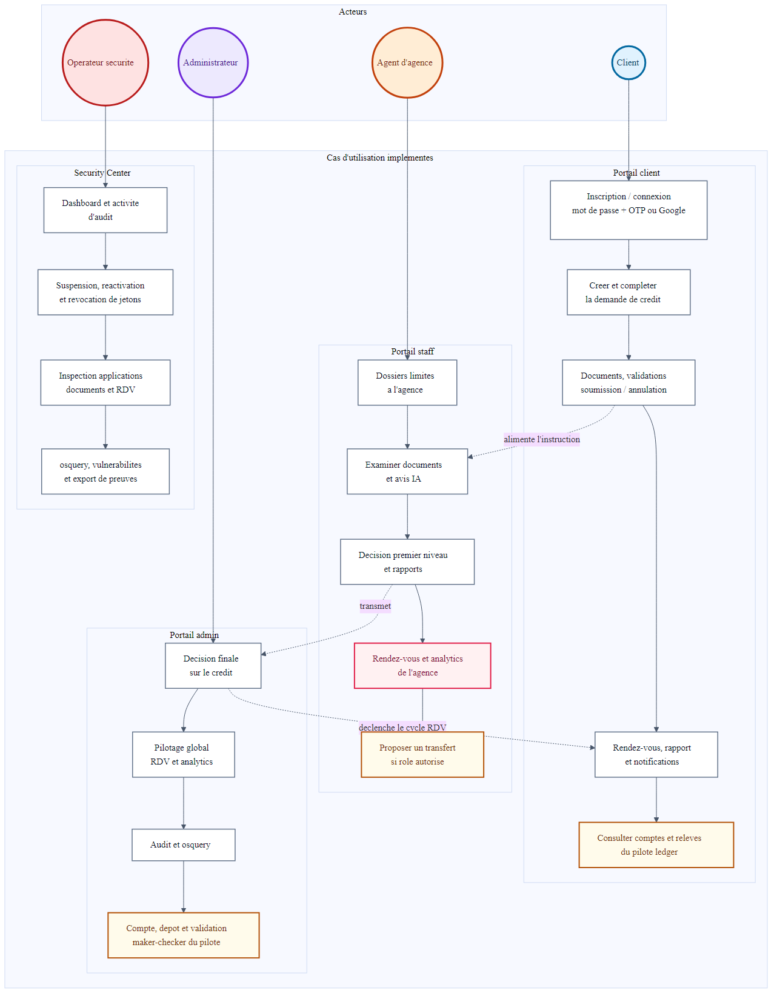

**Figure 1 — Cas d’utilisation par acteur**

La figure distingue les responsabilités des quatre portails et les services transverses. Elle montre aussi que le pilote bancaire reste un module séparé. La séparation visuelle ne suffit pas à la sécurité : chaque cas d’utilisation doit être défendu par le backend.

## 1.6 Exigences fonctionnelles

**Tableau 2 — Exigences fonctionnelles**

| Réf. | Exigence | Critère observable |
|---|---|---|
| F01 | Inscrire et authentifier un client | OTP téléphonique ou identité Google, émission de jeton contrôlée |
| F02 | Constituer un dossier par étapes | Client, demande de crédit, projet et documents persistés |
| F03 | Valider les données | Étapes de validation enregistrées avec erreurs structurées |
| F04 | Soumettre ou annuler | Transition autorisée par la machine d’états |
| F05 | Examiner en agence | Personnel limité aux dossiers de sa branche |
| F06 | Appliquer une double décision | Approbation/rejet initial puis décision administrative finale |
| F07 | Planifier un rendez-vous | Capacité d’agence, jour ouvré, cinq tentatives maximum |
| F08 | Échanger dans un rapport | Messages et pièces jointes autorisés, état de rapport maîtrisé |
| F09 | Notifier les parties | Événements persistés, livraisons asynchrones et déduplication |
| F10 | Produire des analytics | Filtres temporels et de branche, export borné |
| F11 | Auditer les actions | Journal chaîné, contexte utilisateur/personnel/application |
| F12 | Administrer les contrôles de sécurité | Activité, comptes, révocation, télémétrie et exports autorisés |
| F13 | Tester à l’échelle | Génération synthétique isolée et profils de charge protégés |
| F14 | Démontrer un ledger pilote | Comptes TND, transactions équilibrées et maker-checker |

## 1.7 Exigences non fonctionnelles

**Tableau 3 — Exigences non fonctionnelles**

| Domaine | Exigence | État vérifié |
|---|---|---|
| Sécurité | RBAC, propriété, agence, en-têtes, contrôle des fichiers | Partiel ; écarts hauts F-001 à F-013 |
| Intégrité | Transactions, FK, unicité, écritures équilibrées | Fort sur le périmètre testé ; limites métier connues |
| Performance | Requêtes bornées, index mesurés, charge reproductible | Mesures locales disponibles, aucun SLA démontré |
| Disponibilité | Santé des dépendances et tâches | Contrôles présents, haute disponibilité non démontrée |
| Auditabilité | Événements chaînés et traces | Chaînage local présent, immutabilité externe absente |
| Maintenabilité | Modules, tests, formatage, dépendances | Tests solides ; 47 fichiers échouent encore à Pint |
| Portabilité | Environnements local, CI et stockage abstrait | Bonne base ; release audité non reproductible |
| Confidentialité | Données synthétiques et fichiers privés | Démonstration isolée ; gouvernance réelle à confirmer |
| Accessibilité | Interfaces cohérentes et navigables | Builds vérifiés ; audit WCAG formel non fourni |

## 1.8 Périmètre et hypothèses

**Tableau 4 — Périmètre démontré et périmètre exclu**

| Démontré dans le dépôt | Non démontré / exclu |
|---|---|
| Cycle de demande de crédit | Octroi réel de crédit ou conseil financier |
| Quatre portails et API | Certification bancaire ou réglementaire |
| Documents privés et scan configurable | Garantie d’authenticité par l’IA |
| Notifications, queue, outbox, Reverb | Haute disponibilité multi-site |
| Analytics et données synthétiques | SLA de production ou tests massifs validés |
| Sauvegarde/restauration de démonstration | RPO/RTO contractuels, copie hors site immutable |
| Ledger pilote en partie double | Cartes, clearing, intérêts, échéanciers, comptabilité réglementaire |

## 1.9 Méthodologie

La réalisation suit une approche incrémentale appuyée par des migrations versionnées, des services métiers, des contrôleurs fins, des tests unitaires et fonctionnels, des tests E2E et des audits successifs. Pour produire ce rapport, l’état final a été revalidé : versions exécutées, inventaire du code, génération des routes, migration fraîche des 51 fichiers, lecture du schéma réel et confrontation de chaque diagramme au code. Cette méthode évite de documenter une architecture souhaitée comme si elle existait déjà.

## Conclusion du chapitre

Le besoin central est un workflow de crédit traçable et cloisonné. La solution couvre un périmètre fonctionnel riche, mais la valeur académique du projet dépend autant de la transparence sur ses limites que du nombre de fonctions. Le chapitre suivant traduit les besoins en architecture, données et séquences vérifiables.

---

# Chapitre 2 — Analyse et conception

## 2.1 Introduction et méthode de conception

L’analyse part du dossier de crédit comme agrégat principal, puis sépare les invariants qui doivent rester synchrones des traitements pouvant être différés. Les décisions, transitions, rendez-vous, écritures d’audit et inscriptions d’outbox sont conçus autour de transactions courtes. Les livraisons de notification, diffusions et traitements secondaires peuvent être repris par des jobs. Le modèle a évolué par migrations additives et phases d’audit : chaque phase mesure un risque — sécurité, asynchronisme, opérations, charge ou analytics — avant d’ajouter un contrôle ciblé.

La méthode de conception est donc incrémentale et pilotée par les preuves. Les diagrammes de ce chapitre ne représentent pas une architecture idéale future : ils sont dérivés du schéma, des routes et des services courants. Lorsqu’un comportement réel est défectueux, comme la transition prématurée vers le rendez-vous, il est indiqué comme écart à corriger.

## 2.2 Choix architectural

Le backend adopte un **monolithe modulaire Laravel**. Cette forme convient au projet : les transactions entre dossier, décision, rendez-vous, audit et notification restent dans une base cohérente, tandis que les responsabilités sont séparées en contrôleurs, services, modèles, jobs et événements. Les quatre frontends Next.js sont des clients distincts d’une même API. Redis peut servir le cache, les files, l’outbox et la diffusion Reverb selon la configuration. MariaDB est la base de référence pour les contrôles de concurrence ; SQLite accélère une partie des tests.

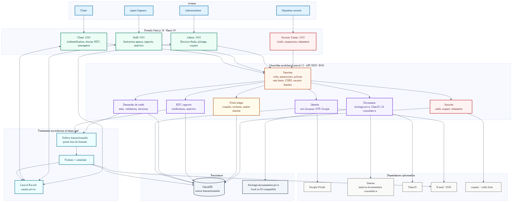

**Figure 2 — Architecture logique globale**

L’architecture sépare présentation, API, métier, persistance et intégrations. Le centre de sécurité est un portail à part entière. Les composants Gemini, ClamAV et stockage S3-compatible sont configurables : leur présence dans le code ne prouve pas qu’un service externe réel était actif pendant tous les tests.

**Tableau 5 — Modules de l’architecture**

| Module | Responsabilité | Preuve principale |
|---|---|---|
| Authentification | OTP, Google, mots de passe, jetons Sanctum | Contrôleurs `Auth`, services OTP/Google/pré-auth |
| Demande de crédit | Saisie, validation, état, soumission | Contrôleurs `CreditApplication`, machine d’états |
| Revue et rendez-vous | Décisions, capacité, tentatives | Services de revue et planification |
| Documents | Stockage privé, MIME, malware, IA | Services `DocumentStorage`, `DocumentSecurity`, Gemini |
| Rapport | Messages, pièces jointes, diffusion | Contrôleurs de rapport, outbox, Reverb |
| Notifications | Persistance, canaux, livraisons | `NotificationService`, jobs et deliveries |
| Analytics | Indicateurs, filtres et qualité | Services `Analytics`, contrôleur staff |
| Sécurité | Activité, utilisateurs, télémétrie | Portail `sc`, contrôleurs Security/Osquery |
| Exploitation | Santé, sauvegarde, génération, charge | commandes Artisan, scripts et rapports d’audit |
| Ledger pilote | Comptes, écritures, transferts | services `Banking`, migrations dédiées |

## 2.3 Modèle de données

Le schéma courant résulte de 51 migrations. Les relations utilisent des clés étrangères et des contraintes d’unicité ciblées. Les suppressions logiques sont appliquées aux entités sensibles telles que les utilisateurs, le personnel, les dossiers et les documents.

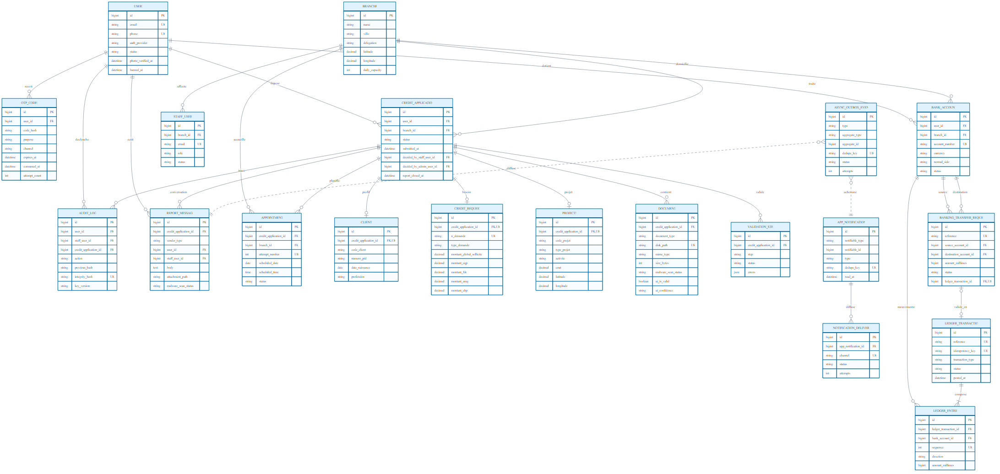

**Figure 3 — Modèle relationnel principal**

La figure présente les agrégats plutôt qu’une copie illisible de chaque colonne. `credit_applications` est le pivot entre le client, l’agence, les données du dossier, les documents, les validations, les décisions, les rendez-vous et le rapport. Les tables de notifications, d’audit, d’outbox et de ledger sont transverses.

**Tableau 6 — Dictionnaire détaillé des entités métier principales**

| Table | Champ(s) | Type observé | Contraintes principales | Description |
|---|---|---|---|---|
| `users` | `id` | entier | PK, non nul | Identifiant du client |
| `users` | `first_name`, `last_name` | chaîne | non nuls | Identité d’affichage |
| `users` | `email` | chaîne | non nul, unique | Adresse de connexion |
| `users` | `phone` | chaîne | nullable, unique | Téléphone OTP |
| `users` | `phone_verified_at` | date-heure | nullable | Date de vérification du téléphone |
| `users` | `password`, `google_id` | chaîne | nullables ; `google_id` unique | Secrets hachés / identité Google |
| `users` | `auth_provider`, `status` | chaîne | non nuls ; défauts `password`, `active` | Fournisseur et état du compte |
| `users` | `banned_at`, `banned_reason`, `banned_by_staff_id` | date-heure, texte, entier | nullables ; FK staff `SET NULL` | Mesure de bannissement |
| `users` | `remember_token`, `created_at`, `updated_at`, `deleted_at` | chaîne / dates | nullables | Session et cycle de vie logique |
| `staff_users` | `id`, `first_name`, `last_name`, `email`, `password` | entier / chaînes | PK ; identité non nulle ; email unique | Compte privilégié |
| `staff_users` | `role`, `status` | chaîne | non nuls ; défauts `staff`, `active` | Rôle et activation |
| `staff_users` | `branch_id` | entier | nullable, FK branche `SET NULL` | Agence de rattachement |
| `staff_users` | `remember_token`, `created_at`, `updated_at`, `deleted_at` | chaîne / dates | nullables | Session et suppression logique |
| `credit_applications` | `id`, `user_id` | entier | PK ; FK client `CASCADE` | Dossier et propriétaire |
| `credit_applications` | `branch_id` | entier | nullable, FK branche `SET NULL` | Agence affectée |
| `credit_applications` | `status` | chaîne | non nul, défaut `DRAFT`, indexé | État de la machine à 17 statuts |
| `credit_applications` | `submitted_at`, `rejection_reason` | date-heure / texte | nullables | Soumission et motif de rejet |
| `credit_applications` | `decided_by_staff_user_id`, `decided_by_admin_user_id` | entier | nullables, FK staff `SET NULL` | Auteurs des deux décisions |
| `credit_applications` | `report_closed_at`, `report_closed_by_staff_id`, `report_closed_reason` | date-heure / entier / chaîne | nullables ; FK staff `SET NULL` | Fermeture du rapport |
| `credit_applications` | `created_at`, `updated_at`, `deleted_at` | dates | nullables, index métier | Cycle de vie et suppression logique |
| `clients` | `id`, `credit_application_id` | entier | PK ; FK dossier unique, `CASCADE` | Fiche client 1–1 du dossier |
| `clients` | `code_client`, `civilite`, `nom`, `prenom`, `nom_epoux`, `deuxieme_prenom` | chaîne | nullables | Identité civile déclarative |
| `clients` | `date_naissance`, `lieu_naissance`, `pays_naissance`, `nationalite`, `pays_residence` | date / chaînes | nullables | Naissance et résidence |
| `clients` | `etat_civil`, `nombre_enfants` | chaîne / entier | nullables | Situation familiale |
| `clients` | `type_pid`, `numero_pid`, `date_delivrance_pid`, `lieu_delivrance_pid`, `numero_carte_sejour` | chaînes / date | nullables | Pièce d’identité et séjour |
| `clients` | `profession`, `date_entree_relation`, `created_at`, `updated_at` | chaîne / dates | nullables | Profession, relation et horodatage |
| `credit_requests` | `id`, `credit_application_id` | entier | PK ; FK dossier unique, `CASCADE` | Demande financière 1–1 |
| `credit_requests` | `n_demande` | chaîne | nullable, unique | Numéro métier de demande |
| `credit_requests` | `identifiant_personne`, `nom_ou_rs`, `prenom_ou_dc`, `type_pid`, `numero_pid` | chaînes | nullables | Identité recopiée pour le flux crédit |
| `credit_requests` | `origine`, `date_depot`, `date_reception`, `type_demande`, `unite_depot` | chaînes / dates | nullables | Métadonnées de dépôt |
| `credit_requests` | `code_devise`, `montant_global_sollicite`, `nombre_credits_sollicites` | chaîne / décimal / entier | nullables | Devise et enveloppe globale |
| `credit_requests` | `montant_eqp`, `montant_fdr`, `montant_amg`, `montant_chp` | décimal | nullables, défaut 0 | Ventilation du financement |
| `credit_requests` | `created_at`, `updated_at` | date-heure | nullables | Horodatage |
| `projects` | `id`, `credit_application_id` | entier | PK ; FK dossier unique, `CASCADE` | Projet 1–1 du dossier |
| `projects` | `code_projet`, `identifiant_personne`, `nom_ou_rs`, `prenom_ou_dc` | chaînes | nullables | Références du projet |
| `projects` | `type_projet`, `objet`, `activite`, `description` | chaînes / texte | nullables ; certains champs indexés avec dossier | Nature et contenu du projet |
| `projects` | `adresse`, `ville`, `code_postal`, `delegation`, `localisation` | chaînes | nullables ; ville/délégation indexées avec dossier | Localisation textuelle |
| `projects` | `latitude`, `longitude` | décimal | nullables | Localisation géographique |
| `projects` | `cout`, `investissement_personnel`, `financement`, `revenus`, `depenses` | décimal | nullables | Hypothèses financières déclarées |
| `projects` | `created_at`, `updated_at` | date-heure | nullables | Horodatage |
| `documents` | `id`, `credit_application_id` | entier | PK ; FK dossier `CASCADE` | Pièce du dossier |
| `documents` | `document_type`, `original_filename`, `disk_path`, `mime_type`, `size_bytes` | chaînes / entier | non nuls ; `disk_path` unique | Métadonnées et emplacement privé |
| `documents` | `ai_verified_at`, `ai_is_valid`, `ai_confidence`, `ai_comment` | date-heure / booléen / chaîne / texte | nullables | Résumé consultatif IA |
| `documents` | `ai_extracted_fields`, `ai_mismatches`, `ai_detected_issues` | texte JSON | nullables | Résultat IA structuré |
| `documents` | `ai_processing_status`, `ai_requires_human_review` | chaîne / booléen | nullables | État de traitement et revue humaine |
| `documents` | `malware_scan_status`, `malware_signature`, `malware_scanned_at` | chaîne / chaîne / date-heure | statut non nul, défaut `unavailable`, indexé | Résultat antimalware |
| `documents` | `created_at`, `updated_at`, `deleted_at` | date-heure | nullables | Cycle de vie logique |
| `validation_steps` | `id`, `credit_application_id` | entier | PK ; FK dossier `CASCADE`, index dossier+étape | Validation rattachée |
| `validation_steps` | `step`, `status`, `errors`, `created_at` | chaînes / texte / date-heure | étape/statut/date non nuls | Résultat et erreurs structurées |
| `branches` | `id`, `name`, `ville`, `address` | entier / chaînes | PK ; non nuls ; ville indexée | Identité d’agence |
| `branches` | `delegation`, `phone`, `opening_hours`, `fax` | chaînes | nullables | Contact et zone administrative |
| `branches` | `latitude`, `longitude` | décimal | non nuls | Position de l’agence |
| `branches` | `daily_capacity`, `slot_start_time`, `slot_end_time`, `is_default` | entier / heures / booléen | non nuls ; défauts 4, 08:00, 12:00, faux | Capacité de rendez-vous |
| `branches` | `created_at`, `updated_at` | date-heure | nullables | Horodatage |
| `appointments` | `id`, `credit_application_id`, `branch_id` | entier | PK ; FK dossier `CASCADE`, FK branche | Rendez-vous rattaché |
| `appointments` | `attempt_number` | entier | non nul ; unique avec dossier | Numéro de tentative |
| `appointments` | `scheduled_date`, `scheduled_time`, `status` | date / heure / chaîne | non nuls ; statut défaut `proposed` | Créneau et décision |
| `appointments` | `decided_at`, `created_at`, `is_auto_scheduled_future` | dates / booléen | décision nullable ; création non nulle ; booléen défaut faux | Suivi de la proposition |
| `report_messages` | `id`, `credit_application_id` | entier | PK ; FK dossier `CASCADE`, index date | Message du rapport |
| `report_messages` | `sender_type`, `user_id`, `staff_user_id`, `body` | chaîne / entiers / texte | type et corps non nuls ; acteurs FK `SET NULL` | Expéditeur et contenu |
| `report_messages` | `attachment_path`, `attachment_name`, `attachment_type`, `attachment_size`, `attachment_disk` | chaînes / entier | nullables ; disque défaut `local` | Pièce jointe privée |
| `report_messages` | `malware_scan_status`, `malware_signature`, `malware_scanned_at`, `created_at` | chaînes / dates | statut défaut `unavailable` ; création non nulle | Contrôle malware et date |
| `app_notifications` | `id`, `notifiable_type`, `notifiable_id` | entier / chaîne | PK ; destinataire polymorphe non nul et indexé | Notification et destinataire |
| `app_notifications` | `type`, `title`, `body`, `data` | chaînes / texte JSON | type/titre/corps non nuls ; données nullables | Contenu de notification |
| `app_notifications` | `dedupe_key`, `read_at`, `created_at`, `updated_at` | chaîne / dates | clé nullable unique | Déduplication, lecture et horodatage |
| `audit_logs` | `id`, `user_id`, `staff_user_id`, `credit_application_id` | entier | PK ; FK nullables `SET NULL`, indexées | Contexte d’acteur et dossier |
| `audit_logs` | `action`, `previous_state`, `new_state` | chaîne / textes JSON | action non nulle, indexée | Mutation auditée |
| `audit_logs` | `ip_address`, `user_agent`, `created_at` | chaîne / texte / date-heure | date non nulle | Contexte technique |
| `audit_logs` | `previous_hash`, `integrity_hash`, `key_version` | chaînes | nullables ; hash d’intégrité unique | Chaîne d’intégrité locale |
| `notification_deliveries` | `id`, `app_notification_id`, `channel` | entier / chaîne | PK ; FK notification `CASCADE` ; couple notification+canal unique | Livraison par canal |
| `notification_deliveries` | `status`, `attempts`, `last_error` | chaîne / entier / chaîne | défauts `pending`, 0 ; erreur nullable | Tentatives et résultat |
| `notification_deliveries` | `delivered_at`, `failed_at`, `created_at`, `updated_at` | dates | nullables | Horodatages de livraison |
| `async_outbox_events` | `id`, `type`, `aggregate_type`, `aggregate_id` | entier / chaînes | PK ; non nuls ; agrégat indexé | Événement durable |
| `async_outbox_events` | `payload`, `dedupe_key`, `status`, `attempts` | texte JSON / chaîne / chaîne / entier | clé non nulle unique ; défauts `pending`, 0 | Charge, idempotence et état |
| `async_outbox_events` | `available_at`, `started_at`, `processed_at`, `failed_at` | dates | disponibilité non nulle ; autres nullables | Cycle de traitement |
| `async_outbox_events` | `queue_delay_ms`, `runtime_ms`, `last_error`, `created_at`, `updated_at` | entiers / chaîne / dates | nullables | Mesures et diagnostic |
| `bank_accounts` | `id`, `user_id`, `branch_id`, `account_number` | entier / entiers / chaîne | PK ; FK `RESTRICT` ; numéro unique | Compte du pilote |
| `bank_accounts` | `product_code`, `currency`, `account_kind`, `normal_side`, `status` | chaînes | non nuls ; devise `TND`, statut `active`; unicité propriétaire+produit+devise | Typologie comptable |
| `bank_accounts` | `created_at`, `updated_at` | dates | nullables | Horodatage |
| `ledger_transactions` | `id`, `reference`, `idempotency_key`, `request_hash` | entier / chaînes | PK ; référence et idempotence uniques | Identité et répétabilité |
| `ledger_transactions` | `transaction_type`, `status`, `currency`, `description` | chaînes | non nuls | Qualification de l’opération |
| `ledger_transactions` | `initiated_by_user_id`, `initiated_by_staff_user_id`, `metadata` | entiers / texte JSON | acteurs FK `RESTRICT`, nullables | Initiateur et contexte |
| `ledger_transactions` | `posted_at`, `created_at` | date-heure | non nulles | Comptabilisation et création |
| `ledger_entries` | `id`, `ledger_transaction_id`, `bank_account_id` | entier | PK ; FK `RESTRICT` | Écriture et compte |
| `ledger_entries` | `sequence`, `direction`, `amount_millimes`, `currency` | entier / chaîne / entier / chaîne | non nuls ; transaction+séquence unique | Débit/crédit et montant entier |
| `ledger_entries` | `created_at` | date-heure | non nulle | Création immutable |
| `banking_transfer_requests` | `id`, `reference`, `idempotency_key`, `request_hash` | entier / chaînes | PK ; référence/idempotence uniques | Identité de demande |
| `banking_transfer_requests` | `source_account_id`, `destination_account_id`, `amount_millimes`, `currency` | entiers / chaîne | comptes FK `RESTRICT`, non nuls | Transfert demandé |
| `banking_transfer_requests` | `status`, `requested_by_staff_user_id`, `checked_by_staff_user_id` | chaîne / entiers | défaut `pending` ; maker non nul ; checker nullable ; FK `RESTRICT` | Workflow maker-checker |
| `banking_transfer_requests` | `ledger_transaction_id` | entier | nullable, FK `RESTRICT`, unique | Transaction créée après validation |
| `banking_transfer_requests` | `approved_at`, `rejected_at`, `rejection_reason`, `created_at`, `updated_at` | dates / chaîne | nullables | Décision et horodatage |
| `otp_codes` | `id`, `user_id`, `code_hash` | entier / entier / chaîne | PK ; FK client `CASCADE` ; hash non nul | Secret OTP haché |
| `otp_codes` | `purpose`, `channel`, `expires_at`, `consumed_at`, `attempt_count` | chaînes / dates / entier | non nuls sauf consommation ; canal `sms`, tentatives 0 | Usage, expiration et anti-bruteforce |
| `otp_codes` | `created_at` | date-heure | non nulle | Création |

Le schéma ne contient pas de colonnes `application_number` ou `is_locked` dans `credit_applications`. Le numéro de demande appartient aux données de crédit et le verrouillage est exprimé par les statuts. Cette précision corrige deux hypothèses présentes dans d’anciens diagrammes.

## 2.4 Machine d’états

La demande utilise 17 statuts : `DRAFT`, trois étapes complétées, deux validations intermédiaires, `FINAL_LOCKED`, `SUBMITTED`, décisions staff et administrateur, trois états de rendez-vous et `CANCELLED`. Les transitions sont centralisées dans `CreditApplicationStateMachine`.

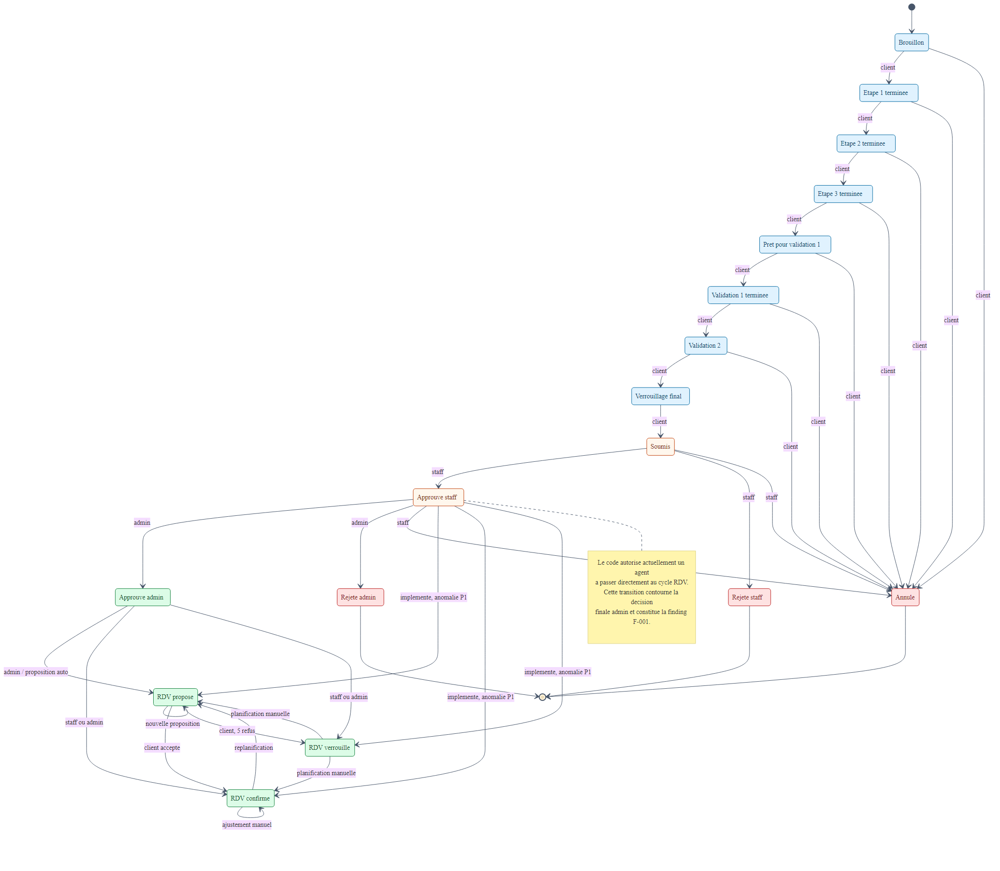

**Figure 4 — Machine d’états de la demande de crédit**

La figure met en évidence une anomalie auditée : le code courant permet au personnel de faire évoluer un dossier `STAFF_APPROVED` vers un rendez-vous avant la décision administrative finale. Cette transition, référencée F-001 dans l’audit, est représentée pour documenter le comportement réel et non pour l’approuver.

**Tableau 7 — Statuts et responsabilités de transition**

| Phase | Statuts | Responsable dominant | Contrôle attendu |
|---|---|---|---|
| Brouillon | `DRAFT`, `STEP_1_COMPLETED`, `STEP_2_COMPLETED`, `STEP_3_COMPLETED` | Client | Propriété du dossier et ordre des étapes |
| Validation | `READY_FOR_VALIDATION_1`, `VALIDATION_1_COMPLETED`, `VALIDATION_2`, `FINAL_LOCKED` | Client + services | Données et documents requis |
| Soumission | `SUBMITTED` | Client | Dossier verrouillé et complet |
| Revue agence | `STAFF_APPROVED`, `STAFF_REJECTED` | Personnel | Permission et branche |
| Décision finale | `APPROVED`, `REJECTED` | Administration | Séparation des décisions |
| Rendez-vous | `APPOINTMENT_PROPOSED`, `APPOINTMENT_CONFIRMED`, `APPOINTMENT_LOCKED` | Personnel/client | Capacité, date ouvrée, max. cinq tentatives |
| Sortie | `CANCELLED` | Acteur autorisé | Transition permise et auditée |

## 2.5 Séquences métier

### 2.5.1 Authentification et onboarding

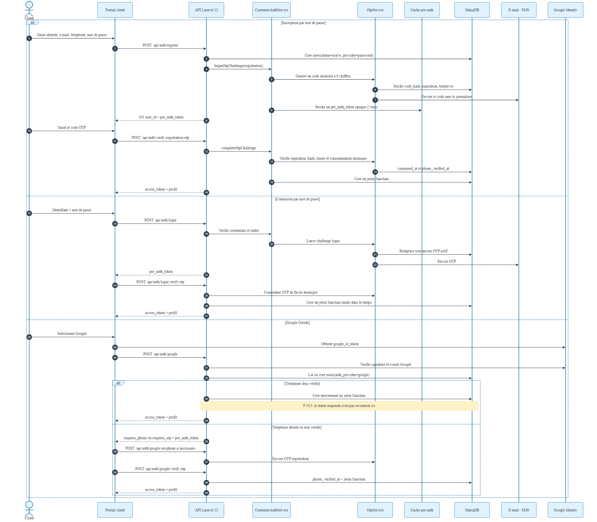

**Figure 5 — Séquence d’authentification et d’onboarding**

Le parcours principal vérifie le téléphone par OTP avant l’accès complet. Le parcours Google vérifie le jeton externe puis collecte le téléphone manquant. L’audit F-015 signale néanmoins que le parcours Google peut émettre un jeton à un compte suspendu ; la vérification de statut doit donc précéder toute émission de session.

### 2.5.2 Constitution et analyse du dossier

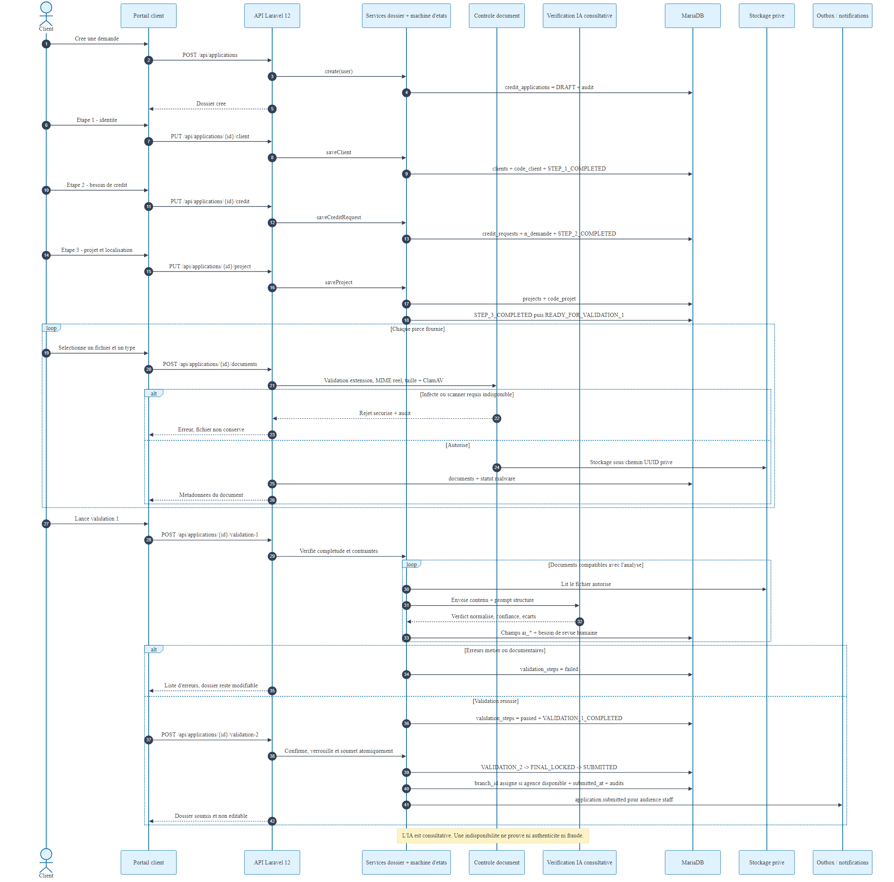

**Figure 6 — Séquence de constitution du dossier et d’analyse documentaire**

Les données client, crédit et projet sont enregistrées par requêtes `PUT`. Les documents passent par validation de type et de contenu, stockage privé, scan malware configurable et analyse IA structurée. L’IA classe et extrait des indices ; elle ne prouve pas l’authenticité. La validation finale reste métier et humaine.

### 2.5.3 Double décision et rendez-vous

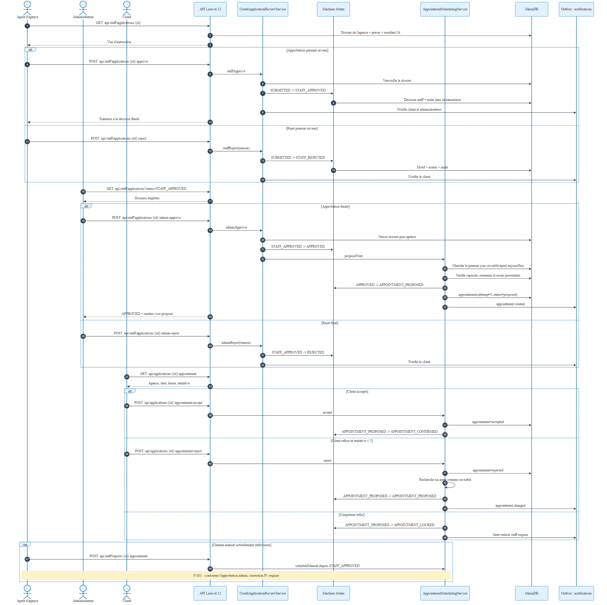

**Figure 7 — Séquence de double décision et de rendez-vous**

La séparation attendue est : revue d’agence, décision administrative finale, puis proposition de rendez-vous. L’algorithme cherche un créneau à partir du prochain jour ouvré et tient compte de la capacité de l’agence. Le dossier peut connaître au plus cinq tentatives. Les opérations sensibles doivent verrouiller les mêmes ressources dans un ordre stable afin de réduire le risque de deadlock relevé par F-021.

## 2.6 Classes et services

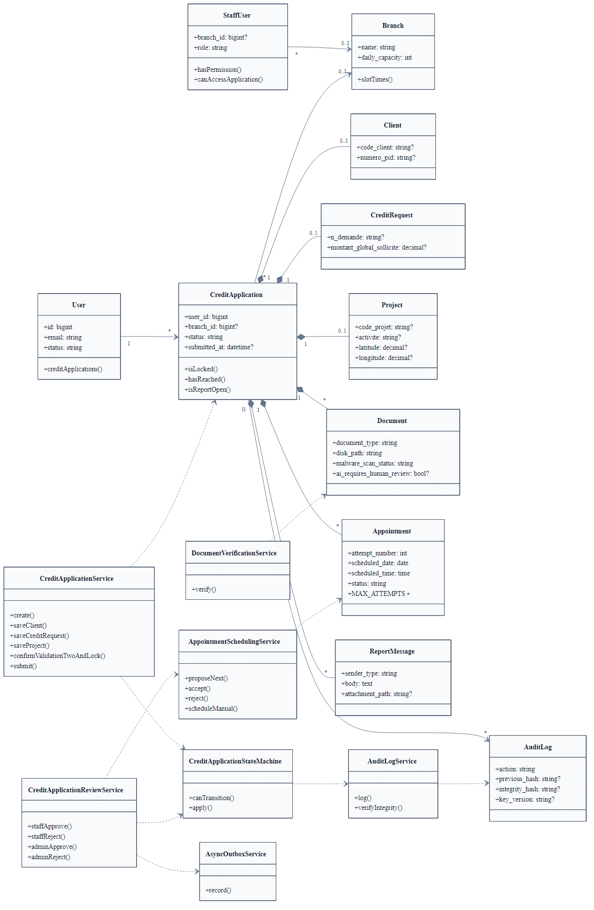

**Figure 8 — Diagramme de classes et services principaux**

Le domaine n’est pas enfermé dans les contrôleurs. La machine d’états, la validation, le scheduling, l’audit, la sécurité documentaire, la notification, l’outbox, l’analytics et le ledger disposent de services spécialisés. Cette séparation facilite les tests et rend les invariants plus visibles. Le volume — 60 services — demande toutefois une gouvernance des interfaces pour éviter les duplications.

## 2.7 Conception de sécurité

**Tableau 8 — Principes de conception de sécurité**

| Principe | Mécanisme observé | Limite à traiter |
|---|---|---|
| Authentification | Sanctum, mot de passe, OTP, Google | MFA absente pour les portails privilégiés |
| Autorisation | rôles, permissions, policies/middleware, propriété | permissions trop larges pour `security`, écarts de branche |
| Isolation agence | `branch_id` et scopes | indicateurs et listes encore transverses dans certains cas |
| Fichiers non fiables | MIME/finfo, taille, UUID, privé, ClamAV | cohérence en cas d’échec de stockage ; disponibilité du scanner |
| Audit | états avant/après et chaîne HMAC versionnée | preuve non exportée vers un support immutable indépendant |
| Temps réel | canaux privés et autorisation de broadcast | canal staff partagé entre branches |
| Secrets | variables d’environnement et audits | scan de secrets final incomplet |
| Navigateur | en-têtes, CORS, CSP | impact résiduel XSS des jetons/session |

## Conclusion du chapitre

La conception établit une base modulaire cohérente autour du dossier. Le schéma, les séquences et les services couvrent le besoin réel, tandis que les écarts représentés montrent les endroits où l’implémentation doit être durcie. Le chapitre suivant relie cette conception aux technologies et composants livrés.

---

# Chapitre 3 — Réalisation

## 3.1 Environnement technique vérifié

**Tableau 9 — Technologies réellement vérifiées**

| Couche | Technologie / version observée | Usage |
|---|---|---|
| Backend | PHP 8.2.12, Laravel 12.66.0 | API, règles métier, jobs et commandes |
| Auth API | Laravel Sanctum 4.3.3 | Jetons personnels et sessions API |
| Temps réel | Laravel Reverb 1.11.1 | WebSocket et canaux privés |
| Base | MariaDB 10.4.32 sous XAMPP | Persistance de référence locale |
| Tests backend | PHPUnit 11.5.56 | Unitaires et fonctionnels |
| Frontends | Next.js 16.3.0, React 19.2.8, TypeScript 5.9.3 | Quatre portails web typés |
| Style | Tailwind CSS 4 | Composants et mise en page |
| Runtime JS | Node.js 24.11.1 local ; Node 22 en CI | Builds, scripts et tests |
| E2E | Playwright 1.62.1 | Parcours navigateur isolés |
| Charge | k6 1.5.0 | Scénarios de charge synthétique |
| Outil desktop | Python 3.10.6, Tk 8.6 | Testeur de charge local |

Les versions sont celles exécutées ou déclarées dans l’état audité. Elles remplacent les mentions historiques Laravel 11 et MySQL 8 contenues dans les anciens diagrammes.

## 3.2 Backend Laravel

Le backend contient 377 fichiers inventoriés, 21 modèles Eloquent, 31 contrôleurs, 6 middleware, 60 services, 5 jobs, 2 événements, 12 commandes Artisan et 104 routes sans doublon de nom détecté. La logique importante est organisée en services transactionnels. Les Form Requests et validations contrôlent les entrées ; les contrôleurs appliquent l’identité et les permissions ; les services exécutent les transitions et produisent les événements d’audit ou d’outbox.

La base est créée par 51 migrations. Une migration fraîche isolée réussit entièrement. Un scénario d’upgrade réaliste a également préservé 1 020 utilisateurs et 1 327 demandes, ce qui apporte une preuve supérieure à la seule reconstruction à vide. Certaines migrations descendantes restent toutefois destructives ou risquées pour des données ayant évolué.

## 3.3 Portails web

**Tableau 10 — Structure des quatre portails**

| Portail | Inventaire | Fonctions principales |
|---|---:|---|
| Client | 89 fichiers | Authentification, wizard, documents, suivi, rendez-vous, rapport, banque pilote |
| Staff | 60 fichiers | File d’agence, revue, décision, rapports, rendez-vous, analytics |
| Admin | 67 fichiers | Vue globale, décision finale, administration et analytics |
| Security Center | 36 fichiers | Tableau de sécurité, activité, comptes, télémétrie, audits et exports |

Chaque portail possède sa configuration Next.js et son build. L’isolation d’interface améliore la compréhension des rôles, mais ne remplace jamais les contrôles serveur. Des composants volumineux et dupliqués entre portails augmentent le risque de divergence, constat F-029.

## 3.4 Implémentation du parcours de crédit

**Tableau 11 — Parcours de réalisation principal**

| Étape | Traitement backend | Résultat utilisateur |
|---|---|---|
| Inscription | OTP, création de compte, statut et audit | Compte vérifié |
| Dossier | upserts des fiches client/crédit/projet | Progression persistante |
| Documents | validation, stockage, malware, IA structurée | Statut de pièce et revue humaine |
| Validations | règles métier et erreurs enregistrées | Correction guidée |
| Soumission | transaction + machine d’états | Dossier transmis |
| Revue staff | permission + branche + décision | Acceptation initiale ou rejet |
| Décision admin | séparation de rôle | Approbation ou rejet final |
| Rendez-vous | capacité et tentatives | Proposition, acceptation ou nouvelle tentative |
| Rapport | messages, pièces jointes, outbox | Échange lié au dossier |

## 3.5 Sous-système documentaire

Le contrôleur de documents ne conserve jamais le nom client comme chemin d’autorité. Il valide la taille et l’extension, compare le MIME déclaré au type obtenu par `finfo`, génère un identifiant serveur, puis passe par l’abstraction `DocumentStorage`. Une implémentation locale privée et une implémentation compatible S3 existent. L’accès en lecture est contrôlé par la policy avant que la réponse force un téléchargement non interprété par le navigateur.

Après stockage, le scanner malware produit un état explicite (`clean`, infecté, erreur ou indisponible selon configuration). L’analyse Gemini reçoit un prompt borné et doit répondre au schéma attendu ; le validateur rejette une réponse non conforme. Les champs extraits, divergences, problèmes détectés et le besoin de revue humaine sont persistés. Le service de validation absorbe l’indisponibilité du fournisseur sans présenter une preuve IA comme décision de sécurité. La cohérence de l’écriture physique et de la ligne SQL reste à renforcer selon F-005.

## 3.6 Rendez-vous et concurrence

`AppointmentSchedulingService` calcule le prochain jour ouvré, sélectionne un créneau dans la plage de l’agence et respecte `daily_capacity`. Le rendez-vous est lié au dossier et à l’agence ; la paire dossier/tentative est unique au niveau base. Un refus du client peut conduire à une nouvelle tentative jusqu’au plafond de cinq. Les opérations concurrentes emploient transactions et verrous, mais les chemins décision administrative/rendez-vous doivent adopter un ordre de verrouillage identique pour supprimer le risque F-021. La transition prématurée F-001 doit aussi être bloquée côté state machine et service, pas uniquement masquée dans l’interface.

## 3.7 Temps réel, notifications et observabilité

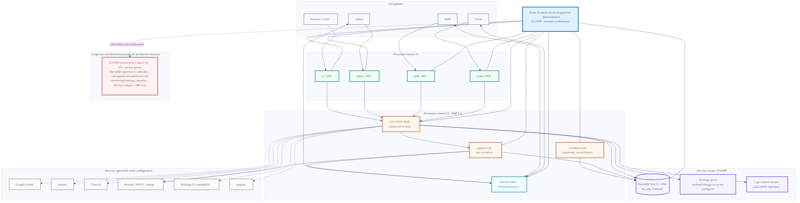

**Figure 9 — Topologie de déploiement observée**

La topologie représente l’environnement local vérifié : quatre applications Next.js, API Laravel, MariaDB, Redis/Reverb selon configuration et services externes optionnels. Elle n’ajoute ni cluster, ni reverse proxy, ni chiffrement d’infrastructure non prouvé. Le port 3003 du centre de sécurité est désormais visible.

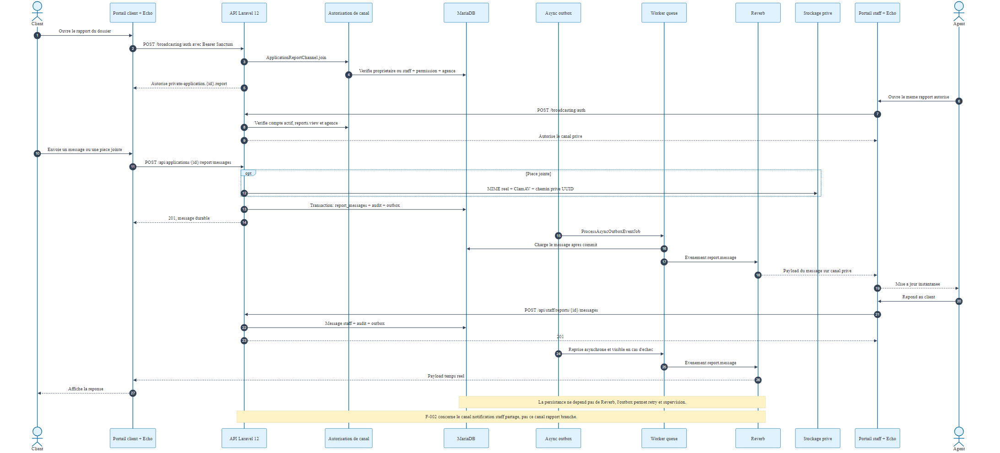

**Figure 10 — Messagerie de rapport en temps réel**

Un message est autorisé, stocké dans une transaction, inscrit dans l’outbox puis diffusé après commit sur `private-application.{id}.report` avec l’événement `.report.message`. Ce schéma réduit le risque de diffuser un événement dont la donnée n’a pas été persistée. L’audit relève néanmoins une course possible dans l’alternance des messages et des lacunes de cycle de vie du rapport.

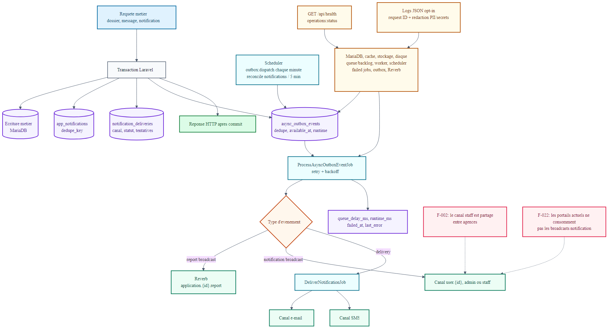

**Figure 11 — Notifications asynchrones et observabilité**

Les notifications applicatives sont persistées et leurs livraisons sont suivies par canal. L’outbox gère disponibilité, tentatives et erreurs. Les contrôles de santé couvrent base, cache, Redis, stockage, disque, queue, worker, scheduler, jobs échoués, outbox et Reverb. Le canal `private-staff` partagé reste un défaut d’isolation de branche (F-002), et les portails ne consomment pas encore tous les événements de notification produits (F-022).

## 3.8 Security Center

Le quatrième portail expose un tableau de bord de sécurité, l’activité, la recherche d’utilisateurs, les actions de suspension/rétablissement, la révocation, des vues de données et télémétrie, des informations de vulnérabilité, des audits osquery et des exports. Ces écrans s’appuient sur les contrôleurs `SecurityCenterController` et `OsqueryAuditController` ainsi que sur les services d’activité et d’osquery.

Deux précautions sont essentielles. Certaines valeurs de télémétrie sont inférées ou simulées et doivent être étiquetées comme telles, défaut F-007. Par ailleurs, le rôle `security` hérite d’une permission de rapport trop large qui lui permet des mutations métier, défaut F-003. Le centre de sécurité doit observer et remédier dans un périmètre explicitement défini, sans devenir un administrateur métier implicite.

## 3.9 Analytics et génération synthétique

Les analytics acceptent des filtres de date bornés à 730 jours. Le personnel est forcé sur sa branche tandis que l’administration peut obtenir une vue globale. L’export est plafonné à 2 500 lignes. Dix contrôles de qualité des données complètent les indicateurs. Des index ont été ajoutés après mesure plutôt que par intuition.

La génération synthétique possède des profils, une porte de sécurité et des points de reprise. Elle permet de démontrer les parcours sans utiliser de données bancaires réelles. Un utilitaire desktop Python/Tk et des scripts k6 aident à préparer et observer les tests. Les profils large, massif, soak et failover n’ont pas été validés et ne doivent pas être annoncés comme réussis.

## 3.10 Pilote bancaire

Le module `/api/v1/banking/*` gère des comptes courants en dinars tunisiens, des transactions et écritures en millimes, des références idempotentes et des demandes de transfert avec séparation maker-checker. Le service ledger vérifie l’équilibre débit/crédit. L’immutabilité fonctionnelle des écritures est un bon principe, mais l’ensemble reste un pilote : pas de cartes, de clearing, d’intérêts, d’échéanciers, de rapprochement réglementaire ni de moteur comptable complet. Les relevés sont en outre chargés sans pagination ou borne de date, constat F-023.

## 3.11 Sauvegarde, restauration et opérations

Les commandes et scripts d’exploitation couvrent la création de sauvegardes, l’inventaire des documents et une restauration dans un environnement isolé. La vérification compare les empreintes et contrôle notamment les comptes, migrations, audits et fichiers. Les battements opérationnels et le service de santé exposent l’état des dépendances applicatives. Ces mécanismes facilitent le diagnostic local, mais une exploitation réelle exige encore chiffrement, stockage hors site immutable, rétention, rotation, alertes, runbooks et exercices de bascule.

## 3.12 Captures d’écran à produire

Aucune capture d’interface exploitable n’existe dans le dépôt. Pour éviter une preuve fictive, les emplacements suivants doivent être remplacés par des captures issues d’un environnement isolé et peuplé de données synthétiques. Les secrets, jetons, téléphones, courriels et chemins locaux doivent être masqués.

**Tableau 12 — Plan de captures d’écran**

| ID | Écran à capturer | État nécessaire | Cadrage recommandé |
|---|---|---|---|
| UI-01 | Page d’accueil et connexion client | Environnement de démonstration | Vue entière, sans console ni barre de favoris |
| UI-02 | Tableau de bord client | Un dossier synthétique en cours | Progression, statut et navigation |
| UI-03 | Wizard de demande | Étape projet ou documents | Champs préremplis synthétiques, erreurs utiles visibles |
| UI-04 | Revue staff | Dossier soumis de la même branche | Résumé, pièces et boutons de décision |
| UI-05 | Décision admin | Dossier `STAFF_APPROVED` | Historique et action finale |
| UI-06 | Analytics | Profil medium chargé | Filtres, KPI et graphique avec période |
| UI-07 | Security Center | Données locales synthétiques | Activité et contrôles, aucune télémétrie simulée présentée comme réelle |
| UI-08 | Testeur de charge desktop | Profil small terminé | Configuration, progression et résultat |

> **Emplacement UI-01 à UI-08 — Captures requises.** Insérer les huit images après validation de leur confidentialité et ajouter une légende datée. Ces emplacements ne sont pas comptés parmi les quatorze figures techniques existantes.

## Conclusion du chapitre

La réalisation matérialise l’architecture dans un backend dense, quatre portails et un ensemble d’outils de validation. Les fonctions avancées — outbox, audit chaîné, analytics mesurés et données synthétiques — renforcent la démonstration. Leur simple présence n’est cependant pas une preuve de préparation bancaire ; cette preuve dépend des résultats et limites du chapitre suivant.

---

# Chapitre 4 — Validation, performance et résultats

## 4.1 Stratégie de validation

La validation combine tests unitaires et fonctionnels, moteur MariaDB réel pour la concurrence, migration fraîche et upgrade, lint/types/build des portails, Vitest, Playwright, audits de dépendances, génération synthétique, benchmark analytics, charge k6 et sauvegarde/restauration. Les mesures sont rapportées sans extrapolation au-delà de l’environnement local.

## 4.2 Résultats consolidés

**Tableau 13 — Résultats de validation**

| Contrôle | Résultat vérifié | Interprétation |
|---|---|---|
| Laravel standard | 427 réussis, 3 ignorés MariaDB-only, 3 126 assertions, 67,54 s | Suite applicative solide |
| Concurrence MariaDB | 3 tests, 57 assertions, tous réussis | Preuve ciblée des invariants concurrents |
| Migration fraîche | 51 migrations réussies | Reconstruction propre valide |
| Upgrade réaliste | 1 020 utilisateurs et 1 327 dossiers préservés | Bonne preuve de compatibilité montante |
| Client | lint, types, build réussis | Portail compilable |
| Staff | lint, types, build réussis | Portail compilable |
| Admin | lint, types, build réussis | Portail compilable |
| Security Center | lint, types, build réussis ; Vitest 8/8 | Portail compilable et tests ciblés |
| Playwright isolé | 10/10 scénarios en environ 3,7 min | Parcours critiques démontrés |
| Composer audit | 0 avis connu | Dépendances PHP déclarées propres à la date de l’audit |
| npm production | 0 vulnérabilité sur racine + quatre portails | Dépendances JS de production propres à la date de l’audit |
| Pint | échec sur 47 fichiers | Dette de formatage non résolue |
| Gitleaks final local | non exécuté | Preuve de secret scanning incomplète |

Le verdict d’audit est **« final audit passed with corrections required »**. Il signifie que la plateforme est prête pour une démonstration isolée, non qu’elle est approuvée comme logiciel de production ou banque réelle.

## 4.3 Données synthétiques

**Tableau 14 — Profils de données synthétiques**

| Profil exécuté | Clients | Demandes | Lignes liées | Durée | Mémoire / volume |
|---|---:|---:|---:|---:|---|
| Small | 1 000 | 1 300 | 18 658 | 4 s | 54 MiB |
| Medium | 50 000 | 65 000 | 931 372 | 353 s | 76 MiB ; base ≈ 454 MiB |
| Large / massive | Non exécuté | Non exécuté | Non mesuré | Non mesuré | À valider |

Les profils small et medium montrent que la génération et les contrôles restent praticables à l’échelle testée. Ils ne permettent pas de prédire un comportement à des millions de clients.

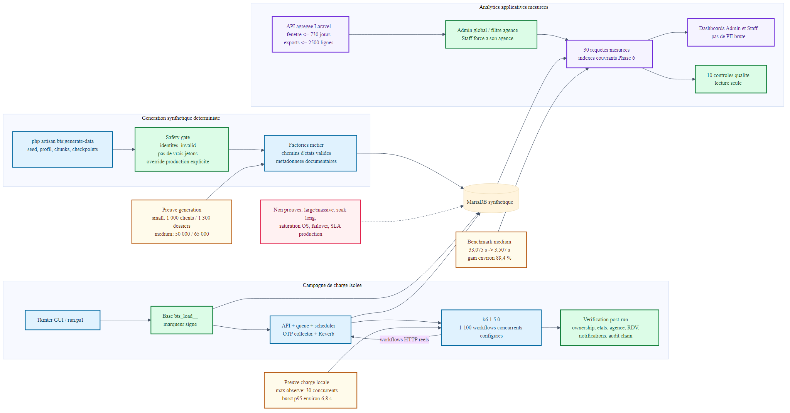

**Figure 12 — Données synthétiques, charge et analytics**

La figure relie la porte de sécurité, la génération, la base isolée, les scénarios k6 et le benchmark analytique. Le flux interdit d’utiliser par défaut une base de production et sépare la création des données de l’observation des performances.

## 4.4 Performance et charge

**Tableau 15 — Mesures de performance disponibles**

| Mesure | Résultat | Limite d’interprétation |
|---|---|---|
| Analytics medium avant index | 33,075 s | Baseline locale |
| Analytics medium après index | 3,507 s | Amélioration d’environ 89,4 % |
| Requêtes analytics | 30 | Cas et filtres audités |
| Mémoire analytics | ≈ 2 MiB | Mesure du processus ciblé |
| Création d’index medium | ≈ 54 s | À planifier lors d’un déploiement réel |
| Concurrence maximale observée | 30 VU | Ne constitue pas une capacité nominale |
| p95 du burst observé | ≈ 6,8 s | Métrique d’ingénierie locale, pas un SLA |
| Soak / failover | Non exécuté | Stabilité longue durée et reprise non prouvées |

L’optimisation analytics est convaincante car elle compare une baseline et un résultat après index sur le même profil. À l’inverse, le p95 de charge n’est pas une promesse de production : le matériel, la latence, la topologie, les caches et les services externes diffèrent d’un déploiement réel.

## 4.5 Validation de sécurité

Les audits Composer et npm de production ne signalent aucun avis connu dans les dépendances déclarées au moment de l’audit. Cela ne signifie ni absence de vulnérabilité inconnue, ni sécurité du code applicatif. Les tests d’autorisation couvrent de nombreux cas de propriété, de rôle et de branche, mais l’audit manuel a précisément découvert des combinaisons non couvertes, dont F-001 à F-004 et F-015.

Le workflow CI contient un contrôle Gitleaks épinglé et une production de SBOM. Le scan Gitleaks n’a cependant pas été réexécuté localement sur l’arbre final, très modifié, de sorte que la preuve finale est incomplète (F-036). Avant release, le scan doit porter sur un commit propre et son résultat être archivé avec le hash du commit. Une revue statique, un test de pénétration externe et une revue de configuration de production restent à réaliser.

## 4.6 Sauvegarde et restauration

La phase d’exploitation a produit une sauvegarde de base de 57 179 octets et recensé 2 886 fichiers documentaires totalisant 1 537 268 octets. Une preuve ultérieure mentionne une opération de backup de 39 371 ms et une vérification de restauration isolée de 3 281 ms. Les contrôles ont validé les empreintes, les comptes, les migrations, l’audit et les documents dans le périmètre du test.

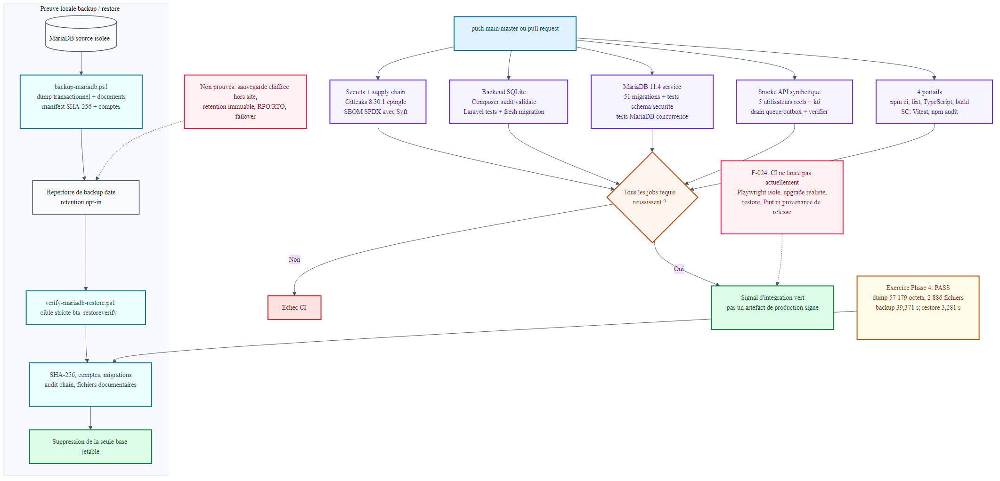

**Figure 13 — CI/CD, sauvegarde et restauration**

La figure montre les gates présents et ceux qui manquent : la CI exécute notamment le scan de secrets configuré, le SBOM, les tests backend, MariaDB, un smoke k6 et les quatre frontends. Elle n’intègre pas encore Playwright, l’upgrade réaliste, la restauration, Pint ni une preuve de provenance de release. La restauration locale n’est pas un plan DR : aucune copie hors site immutable, aucun RPO/RTO contractuel et aucun exercice de bascule ne sont démontrés.

## 4.7 Limites restantes et lecture critique des résultats

Les résultats prouvent trois qualités. Premièrement, le domaine est largement couvert par des tests automatisés. Deuxièmement, les migrations et scénarios de concurrence ont été exercés sur le moteur de référence, pas seulement sur SQLite. Troisièmement, la génération synthétique fournit une manière responsable de présenter l’application sans données réelles.

Ils laissent néanmoins quatre zones ouvertes : les constats hauts de contrôle d’accès et de workflow ; la robustesse opérationnelle longue durée ; la release reproductible depuis un arbre propre ; la conformité externe. Ces limites justifient un passage par des gates de correction avant toute expérimentation avec des utilisateurs ou données réels.

## Conclusion du chapitre

La campagne apporte des preuves quantitatives précises et reproductibles sur le périmètre local. Elle confirme l’aptitude à la démonstration et invalide toute conclusion hâtive de préparation bancaire. Le dernier chapitre transforme les constats en contrôles et plan d’amélioration.

---

# Chapitre 5 — Sécurité, qualité et exploitation

## 5.1 Sécurité documentaire

Un document téléversé est traité comme non fiable. L’extension et la taille sont vérifiées, `finfo` contrôle le type réel, un nom UUID empêche de faire confiance au nom client, et le fichier reste dans un stockage privé. ClamAV peut être obligatoire ; un résultat infecté est toujours rejeté et une indisponibilité échoue en mode fermé lorsque l’exigence est activée. Le téléchargement impose l’autorisation, `Content-Disposition: attachment` et `X-Content-Type-Options: nosniff`.

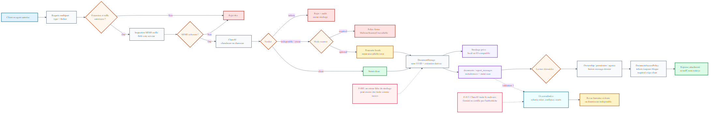

**Figure 14 — Pipeline de sécurité documentaire**

L’analyse Gemini est volontairement séparée du verdict de sécurité. Elle produit une réponse structurée, un score, des champs extraits, des divergences et un besoin de contrôle humain. Elle reste consultative et peut être indisponible. Les constats F-005 et F-013 imposent de rendre atomique la confirmation de stockage et de ne jamais appeler « authentique » un document sur la seule base de l’IA.

## 5.2 Autorisation et cloisonnement

Le registre de permissions distingue client, staff, admin, security et rôles internes. Le client est restreint à ses ressources ; le staff est normalement forcé sur son agence ; admin et super-admin disposent de vues plus larges. L’audit montre cependant que des permissions combinées peuvent dépasser l’intention : le rôle security peut modifier des rapports ou rendez-vous via `reports.view`, un staff peut engager le rendez-vous avant décision admin et certaines vues agrègent des branches différentes.

La correction doit appliquer la même règle sur chaque couche : route, middleware, policy, requête, service et canal de diffusion. Une interface masquée n’est pas un contrôle. Les tests doivent inclure des matrices négatives : autre client, autre agence, rôle security, compte suspendu et transition invalide.

## 5.3 Audit, traçabilité et données personnelles

Les journaux enregistrent l’acteur, le dossier, l’action, les états précédent et suivant, l’IP et l’agent utilisateur. Un hash précédent, un hash d’intégrité unique et une version de clé forment une chaîne de détection d’altération. Cette chaîne renforce l’intégrité locale, mais un acteur ayant un contrôle suffisant sur la base et les clés pourrait réécrire l’historique. Une exportation signée vers un stockage append-only indépendant est nécessaire avant une prétention d’immutabilité.

Les données KYC, documents et rapports sont des PII. Les données de démonstration doivent rester synthétiques, les logs doivent éviter les secrets, et les listes de clients bannis doivent respecter l’agence. La rétention, le droit d’accès, la suppression légale et les transferts internationaux de données restent à définir avec un responsable compétent.

## 5.4 Contrôles et limites

**Tableau 16 — Contrôles de sécurité et limites**

| Contrôle | Couverture actuelle | Action requise |
|---|---|---|
| OTP client | Implémenté et testé | Surveiller abus, expiration et fournisseur réel |
| Google Identity | Vérification de jeton | Bloquer un compte suspendu avant émission de jeton |
| MFA privilégiée | Absente | Imposer MFA staff/admin/security |
| RBAC | Registre et middleware présents | Réduire les permissions implicites et tester les refus |
| Isolation de branche | Modèle et scopes présents | Corriger listes, métriques et canal temps réel partagé |
| Malware | Scanner configurable, fail-closed possible | Superviser signatures et disponibilité réelle |
| IA documentaire | Schéma strict et revue humaine | Conserver un libellé consultatif/fail-open maîtrisé |
| Audit chaîné | HMAC local versionné | Export immutable externe et rotation gouvernée |
| En-têtes/CORS/CSP | Présents | Durcir la posture navigateur et le stockage de jeton |
| Dépendances | Audits propres à la date | Automatiser mises à jour et blocage continu |
| Secrets | Gitleaks configuré en CI | Scanner l’arbre final propre et conserver la preuve |
| Sauvegarde | Preuve locale de restauration | Chiffrement, hors site, immutabilité, RPO/RTO et exercice |

## 5.5 Préparation opérationnelle

**Tableau 17 — Matrice de préparation opérationnelle**

| Usage | Décision | Justification |
|---|---|---|
| Démonstration académique isolée | Oui, avec données synthétiques | Parcours, tests et builds validés |
| Pilote interne sans données réelles | Conditionnel | Corriger d’abord les constats P0/P1 |
| Logiciel de production | Non | 13 constats hauts et preuves opérationnelles incomplètes |
| Banque réelle | Non | Réglementation, HA, DR, MFA, ledger complet et gouvernance absents |
| Ledger de démonstration | Oui, clairement étiqueté pilote | Partie double et maker-checker couverts dans le périmètre |

Les sondes de santé doivent être séparées : une liveness simple et non mutable, une readiness bornée, et des diagnostics profonds protégés. L’actuelle readiness publique effectue des vérifications relativement coûteuses. Les workers, le scheduler, les jobs échoués, l’outbox et Reverb doivent être supervisés avec des alertes et des runbooks.

## 5.6 Backlog priorisé

**Tableau 18 — Backlog de correction priorisé**

| Priorité | Corrections regroupées | Condition de sortie |
|---|---|---|
| P0 | Bloquer le rendez-vous avant décision admin ; isoler les canaux et accès par branche ; empêcher security de muter le métier | Tests négatifs multi-rôles et multi-branches réussis |
| P1 | MFA privilégiée ; stockage documentaire atomique ; configuration production fail-closed ; statut Google ; audit externe ; correctifs rapport et locks | Revue sécurité et campagne E2E/concurrence renouvelées |
| P1 | Release propre et reproductible ; sauvegarde hors dépôt ; preuve Gitleaks ; gates CI manquants | Build depuis commit propre avec artefacts signés |
| P2 | Pagination des relevés ; invariants de ventilation ; documents par catégorie ; validation de filtres ; CSP/session | Tests de régression et mesures disponibles |
| P2 | DR hors site, RPO/RTO, soak et failover ; readiness allégée | Exercice documenté et alertes testées |
| P3 | Pint sur 47 fichiers ; réduction des composants dupliqués ; nettoyage des artefacts générés | Qualité statique verte et dépôt propre |

## 5.7 Gouvernance de release

Une release candidate doit être produite depuis un commit propre, étiqueté et reproductible. Les dépendances doivent être verrouillées, le SBOM archivé, les scans associés au hash du commit, et les résultats de tests conservés. Le pipeline doit intégrer les contrôles les plus probants : Playwright isolé, migration fraîche, upgrade réaliste, concurrence MariaDB, restauration, Pint et scan de secrets sur l’arbre final. Les migrations descendantes dangereuses doivent être remplacées par des procédures de roll-forward ou des plans de récupération testés.

## Conclusion du chapitre

BTS Bank possède des mécanismes de sécurité avancés pour un projet académique, mais plusieurs écarts se trouvent précisément aux frontières les plus sensibles : autorisation, branche, identité privilégiée, documents, audit et reprise. La voie vers un pilote interne n’est donc pas l’ajout de nouvelles fonctions ; c’est la fermeture mesurée de ces écarts et la production de preuves de release.

---

# Conclusion générale et perspectives

Le projet BTS Bank démontre la conception et la réalisation d’une plateforme multiportail complète autour d’une demande de crédit. Les contributions majeures sont la modélisation d’un dossier progressif, une machine d’états explicite, la double décision, la planification de rendez-vous, le traitement sécurisé des documents, la messagerie liée au dossier, les notifications asynchrones, l’audit chaîné, les analytics mesurés et la génération de données synthétiques. Le pilote ledger ajoute une démonstration utile de partie double et de maker-checker sans être confondu avec un cœur bancaire.

La validation fournit des résultats concrets : 427 tests Laravel, des tests MariaDB de concurrence, 51 migrations fraîches, un upgrade préservant les données, quatre builds frontend et 10 scénarios E2E réussis. L’amélioration analytics d’environ 89,4 % montre également une démarche d’optimisation fondée sur la mesure.

La conclusion doit rester proportionnée aux preuves. Le système est adapté à une soutenance et à une démonstration isolée avec données synthétiques. Il n’est pas prêt pour la production, encore moins pour des opérations bancaires réelles. Les 13 constats hauts portent sur des sujets qui ne peuvent être compensés par l’interface ou la documentation.

Les perspectives sont ordonnées ainsi :

1. fermer les défauts d’autorisation, de workflow et de cloisonnement par agence ;
2. imposer une MFA aux comptes privilégiés et durcir les sessions navigateur ;
3. rendre atomiques les écritures documentaires et externaliser la preuve d’audit ;
4. rendre chaque release propre, scannée, reproductible et liée à ses résultats ;
5. prouver la sauvegarde hors site, la restauration, le RPO/RTO, le soak et le failover ;
6. consolider le ledger seulement après stabilisation du cœur de crédit ;
7. conduire les revues réglementaires, vie privée, accessibilité et sécurité externes nécessaires avant toute donnée réelle.

Cette progression transforme le projet d’une démonstration techniquement riche en un logiciel dont les garanties sont explicites, testées et gouvernées.

---

# Annexes

## Annexe A — Cartographie synthétique des routes

**Tableau 19 — Cartographie synthétique des routes**

| Domaine | Préfixes / opérations vérifiés | Autorisation attendue |
|---|---|---|
| Auth client | inscription, vérification, connexion, Google, téléphone, mot de passe, déconnexion | Public limité puis client authentifié |
| Dossier client | création, `PUT` client/crédit/projet, documents, validations 1/2, soumission, annulation | Propriétaire du dossier |
| Rendez-vous client | consultation, acceptation, refus | Propriétaire et état valide |
| Rapport client | liste/envoi de messages et pièces | Propriétaire et rapport autorisé |
| Staff | applications, approbation/rejet, documents, rapports, rendez-vous, analytics, notifications | Permission + branche |
| Admin | approbation/rejet final et vue globale | Permission administrative |
| Security | dashboard, activité, utilisateurs, suspension, révocation, données, télémétrie, vulnérabilités, osquery, export | Permissions de sécurité explicites |
| Banking | `/api/v1/banking/*` comptes, transactions, transferts | Permissions maker/checker/lecture |
| Temps réel | authentification broadcasting | Canal privé + propriété/agence |

Le fichier généré `route:list --json` contient 104 routes sans doublon. Les détails normatifs restent dans `backend/routes/api.php`, `backend/routes/api/v1/banking.php` et `backend/routes/channels.php`.

## Annexe B — Éléments à confirmer avant dépôt

**Tableau 20 — Éléments restant à confirmer**

| No | Élément | Pourquoi il n’est pas inventé ici |
|---:|---|---|
| 1 | Auteur, établissement, filière, organisme, encadrants, jury, lieu et date | Absents du dépôt courant |
| 2 | Autorisation d’utiliser le nom et le logo BTS Bank | Aucune affiliation officielle n’est prouvée |
| 3 | Hôte, réseau, dimensionnement et exploitation de production | Seul l’environnement local/CI est observé |
| 4 | Activation réelle et contrats Google, SMS, Gemini, ClamAV et stockage externe | Code configurable, secrets et services réels non audités |
| 5 | Huit captures d’interface finales | Aucun jeu de captures vérifiable dans le dépôt |
| 6 | Avis juridique, vie privée, réglementaire, accessibilité et pentest externe | Hors preuves du dépôt et à réaliser par les responsables compétents |

## Annexe C — Références techniques internes

- Audit de référence : `docs/audit/BTS_FINAL_FULL_PROJECT_AUDIT.md`.
- Rapports spécialisés : `docs/audit/PHASE_2_SECURITY_COMPLIANCE_REPORT.md` à `PHASE_6_BI_ANALYTICS_REPORT.md`.
- Sources de vérité des routes : `backend/routes/api.php`, `backend/routes/api/v1/banking.php`, `backend/routes/channels.php`.
- Sources de vérité du schéma : `backend/database/migrations/`.
- Machine d’états : `backend/app/Services/CreditApplicationStateMachine.php` et l’enum de statut associé.
- Sécurité documentaire : `backend/app/Services/DocumentSecurity/`, `DocumentStorage/` et services Gemini.
- Analytics et génération : `backend/app/Services/Analytics/` et `backend/app/Services/SyntheticData/`.
- Diagrammes actifs : `diagramme/*.mmd`, rendus dans `diagramme/img/`.
- Audit des diagrammes : `docs/report/BTS_DIAGRAM_AUDIT.md`.
- Traçabilité du contenu : `docs/report/BTS_BANK_REPORT_CONTENT_MAP.md`.

## Annexe D — Règles de lecture du rapport

Les nombres de tests, durées, versions et volumes correspondent aux preuves du dépôt au 24–25 août 2026. Ils ne sont pas des garanties futures. Les constats F-001 à F-036 renvoient à l’audit final. Les figures ont été redessinées et validées avec Mermaid CLI 11.12.0 contre l’implémentation courante. Les anciennes copies de `diagramme/mm/` et les anciens rendus de `diagramme/img/legacy/` sont des archives et ne doivent pas être utilisés.
